# System Request Document

> Matthew - Gantt Chart
> Caleb - Data Model
> Garret - Executive Summary/Sequence Diagram
> Cheng Eu - Structure Chart

## Table of Contents

1. System Request
2. Work Plan
3. Feasibility Analysis
   1. Technical Feasibility
   2. Organizational Feasibility
4. Requirements Definition
   1. Functional Requirement
   2. Non-functional Requirement
5. Logical Design
   1. Sequence Diagram
   2. Use Cases
   3. Process Modeling (Data Flow Diagram)
      1. Level 0 Diagram
      2. Level 1 Diagram
      3. Level 2 Diagram
      4. Level 3 Diagram
      5. Level 4 Diagram
      6. Level 5 Diagram
   4. Data Modeling (Entity Relationship Diagram)
   5. Structure Chart Diagram
6. Appendices

## Executive Summary
> A summary of all the essential information in the proposal so that a busy executive can read it quickly and decide what parts of the plan to read in more depth.

## 1. System Request

- **Project Sponsors:** Cheng Eu Sun, Garret Van Dyke, Caleb Rice, Matthew Merlo 
- **Business Requirements**: The Enorthernpike Course Registration System aims to streamline the course planning process by providing a unified, user-friendly platform that integrates functionalities from existing systems like Degreeworks and Ecarps. Key functional requirements include secure user authentication, intuitive course search and registration, degree progress tracking, personalized course recommendations, and robust reporting and analytics capabilities. Non-functional requirements focus on usability, security, scalability, and reliability to ensure a seamless and efficient user experience. Compliance with data protection regulations and integration with existing university systems are also essential considerations.
- **Business Need:** This project has been initiated to create a unified course registry/planner for all Messiah students to create an 8-semester course plan and all necessary course information in one place.
- **Business Value:** Replacing the existing course registration system with a more modern, user-friendly system will provide much value to any university that chooses to use our system. With the information about what classes they need and when they are offered as well as the ability to create an 8-semester plan right at students' fingertips, there will be much fewer confusions that faculty will need to resolve. This will greatly streamline advising. There will also be much less of a need to accomodate students who fail to complete the right courses to earn their degree, as it will be much easier for students to avoid this scenario. Finally, the ease of getting into the right courses and confidence that a student knows what they need to do to graduate can have a major effect on their opinion of the college, so this will help universities retain students and gain more positive feedback in general.
- **Special Issues and Constraints:** Collecting students personal information as it comes to certain classes and times they take them could pose a certain level of conidentiality issue. Deciding the size of the project could be an issue, we need to make sure we add enough features that it will be significantly better than the current system, but not too much that the UI is confusing and too bothersome to learn since students really only use it once a semester. Security may be an issue since all sponsors/group members have taken few cybersecurity classes AKA outsourcing may be a nessecity. 

## 2. Work plan
> The original work plan revised after having completed the analysis phase.
### Gantt Chart
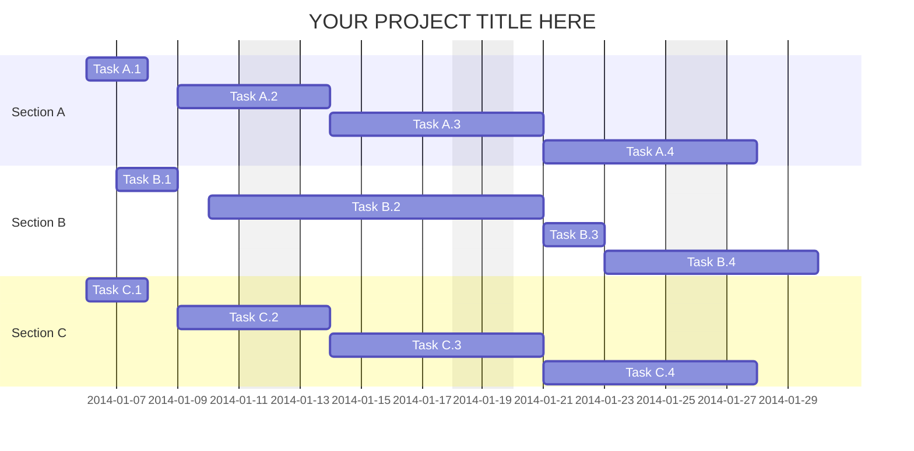
```mermaid 
gantt
    dateFormat  YYYY-MM-DD
    title       YOUR PROJECT TITLE HERE
    excludes    weekends
    %% (`excludes` accepts specific dates in YYYY-MM-DD format, days of the week ("sunday") or "weekends", but not the word "weekdays".)

    section Section A
    Task A.1            :         des1, 2014-01-06,2014-01-08
    Task A.2            :         des2, 2014-01-09, 3d
    Task A.3            :         des3, after des2, 5d
    Task A.4            :         des4, after des3, 5d

    section Section B
    Task B.1            :         des5, 2014-01-07,2014-01-09
    Task B.2            :         des6, 2014-01-10, 7d
    Task B.3            :         des7, after des3, 2d
    Task B.4            :         des8, after des7, 5d

    section Section C
    Task C.1            :         des9, 2014-01-06,2014-01-08
    Task C.2            :         des10, 2014-01-09, 3d
    Task C.3            :         des11, after des2, 5d
    Task C.4            :         des12, after des3, 5d

```

## 3. Feasibility Analysis

### 3.1 Technical Feasibility
Technically, this project is complex but doable. It's really just a standard Model-View-Controller app, with a UI that could be designed with a JavaScript framework like React or Vue, and then we would need a database with several tables and a server-side framework to communicate with it. While there would be some complex design issues in terms of getting the right data in the right place at the right time, these would be worked out in the design phase and at that point it's just coding it which shouldn't be that difficult, especially since we would have a full year to get it working. The main issue with the technical feasibility would be the security. Given that none of the project sponsors are cybersecurity experts, we would need to spend considerable resources looking into this, and since we would be dealing with information protected by FERPA and managed by an actual University, some of which is sensitive, this is not an area that we can afford to do poorly.

### 3.2 Organizational Feasibility
There is a couple of issues in terms of organizational feasibilites, however there are also some organizational feasibilities that are possible for us, so lets start with those. In terms of cost there is really no issue. The financial requirements of the whole system are extremely low. We would most likely need to buy nothing. We would however run into issues in terms of having a member of the current organization keep the system up to date semester over semester. Now onto the issues. The biggest issue is the security risk. Since there is a security risk that we face and we are not apart of the adminsitration there will be some difficulty to get access to information we would need. Also FERPA would make our project difficult since it protects students schedules which is something we would eventually need to deal with. Another problem is since our chosen organization has their own planning system and they don't want to have students getting mixed up with a variety of different planning softwares meaning it would be difficult to have an offical system that the university uses without replacing the current software. Another problem is that our organization is changing how registration works next year (the time we have to create our system) it creates extra difficulties to get the required items that we need from our orginization. Continuing on with the difficulties of obtaining our needed information we may run into some time constraints since we only have a year to get this project done we would need to request information from the registrar/IT early and even then we may not be able to start on certain parts of the project until we get that information meaning that we would have to wait to start certain parts of it.
## 4. Requirements Definition

### 4.1 Functional Requirements:

1. User Authentication
   - Secure login and registration for students, faculty, and staff.
   - Role-based access control to ensure appropriate access levels.

2. Course Planning

   - Intuitive interface for course search and planning.
   - Real-time course availability/offerings status displayed during selection.

3. Degree Progress Tracking

   - Integration with academic records to track degree requirements and progress.
   - Visual representation of completed and remaining courses.

4. Reporting and Analytics

   - Generate reports on course registration, student progress, and system usage.
   - Analytics dashboard for monitoring system performance and user engagement.

5. Course Search

   - Improved ability for course searching by name.

### 4.2 Nonfunctional Requirements:

1. **Operational**

2. **Performance**

3. **Security**

4. **Cultural and political**

## 5. Logical Design

> A set of use cases that illustrate the basic processes that the system needs to support.

### 5.1 Sequence Diagram

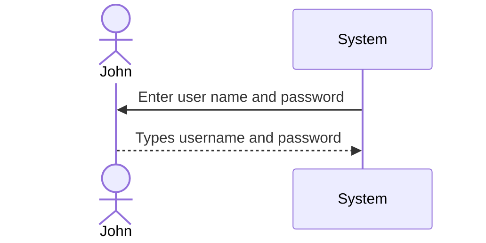
```mermaid
sequenceDiagram
   actor J as John
   participant S as System

   S->>J: Enter user name and password
   J-->>S: Types username and password

```

### 5.2 Use Cases
> *Reference Chapter 4*

#### Use Case Name:  Edit Program Requirements

> __ID__ : UC-1

> __Priority__ : High

> __Actor__ : Faculty

> __Description__ : Faculty use the system to view and edit the requirements for academic programs.

> __Trigger__ : Faculty selects the "View/Edit Requirements" tab

> __Type__ : External

> __Preconditions__ :
>   1. Faculty must be logged into the system.
>   2. Faculty must have permission to edit programs.
>   3. Faculty must have selected the "View/Edit Requirements" tab.

| Normal Course:                                                                                                  | Information for Steps                                                      |
| --------------------------------------------------------------------------------------------------------------- | -------------------------------------------------------------------------- |
| 1.4 Select program **Number is out of order due to this being missing for a a large part of the analysis phase* |
| 1. Current requirements display with add and remove buttons                                                     | $\leftarrow$ Current program requirements $\leftarrow$ Selected program |
| 2. Add a requirement                                                                                            | $\leftarrow$ Selected program                                              |
| 3. Remove a requirement                                                                                         | $\leftarrow$ Selected program                                              |

> __Postconditions__ :
>   1. Selected academic program is updated with any added or removed requirements

| Summary Inputs               | Source                        | Summary Outputs          | Destination |
| ---------------------------- | ----------------------------- | ------------------------ | ----------- |
| List of current requirements | Program requirements database | New program requirements | Faculty     |
| Selected program             | Faculty                       |

#### Use Case Name: View Current Requirements (Faculty)

> __ID__ : UC-1.1

> __Priority__ : High

> __Actor__ : Faculty

> __Description__ : Faculty views the requirements for a program with the option to edit the requirements.

> __Trigger__ : Faculty selects a program

> __Type__ : External

> __Preconditions__ :
>   1. Faculty must be logged into the system.
>   2. Faculty must have permission to edit programs.
>   3. Faculty must have selected the "View/Edit Requirements" tab.
>   4. Faculty must have selected a program to view or edit.

| Normal Course:                            | Information for Steps                                                             |
| ----------------------------------------- | --------------------------------------------------------------------------------- |
| 1.1.1. Fetch current requirements         | $\leftarrow$ Selected program                                                     |
| 2. List current requirements in table     | $\leftarrow$ Selected program   $\leftarrow$ Requirements for selected program |
| 3. Add an add button                      |                                                                                   |
| 4. Add delete buttons to each table entry |                                                                                   |
| 5. Build page container                   |                                                                                   |
| 6. Build webpage                          |                                                                                   |

> __Postconditions__ :
>   1. Selected academic program is updated with any added or removed requirements

| Summary Inputs       | Source                        | Summary Outputs                    | Destination |
| -------------------- | ----------------------------- | ---------------------------------- | ----------- |
| Selected program     | Faculty                       | Interface for editing requirements | Screen      |
| Program requirements | Program requirements database |

#### Use Case Name: Fetch Current Requirements

> __ID__ : UC-1.1.1

> __Priority__ : High

> __Actor__ : System

> __Description__ : System queries the database to get the requirements for the selected program

> __Trigger__ : Faculty selects a program

> __Type__ : External

> __Preconditions__ :
>   1. Faculty must be logged into the system.
>   2. Faculty must have permission to edit programs.
>   3. Faculty must have selected the "View/Edit Requirements" tab.
>   4. Faculty must have selected a program to view or edit.

| Normal Course:                                              | Information for Steps             |
| ----------------------------------------------------------- | --------------------------------- |
| 1.1.1.1. Query the database to get the current requirements |                                   |
| 2. Send the requirements to be displayed and edited         | $\leftarrow$ Program requirements |

> __Postconditions__ :
>   1. Current program requirements are ready to be displayed.

| Summary Inputs       | Source                        | Summary Outputs              | Destination   |
| -------------------- | ----------------------------- | ---------------------------- | ------------- |
| Selected program     | Faculty                       | List of program requirements | Process 1.1.2 |
| Program requirements | Program requirements database |

#### Use Case Name: List current requirements in table

> __ID__ : UC-1.1.2

> __Priority__ : High

> __Actor__ : System

> __Description__ : System takes the list of current requirements for a program and displays it in a table.

> __Trigger__ : The database has been queried for program requirements.

> __Type__ : Internal

> __Preconditions__ :
>   1. Faculty must be logged into the system.
>   2. Faculty must have permission to edit programs.
>   3. Faculty must have selected the "View/Edit Requirements" tab.
>   4. Faculty must have selected a program to view or edit.
>   5. The database must be queried and the data must be in a format accessible to the table builder component.

| Normal Course:                          | Information for Steps                      |
| --------------------------------------- | ------------------------------------------ |
| 1.1.2.1. Build each row of the table    |                                            |
| 2. Populate those rows with cells       |                                            |
| 3. Fetch the data to populate the cells | $\leftarrow$ Selected program requirements |
| 4. Render the table                     |                                            |

> __Postconditions__ :
>   1. Current program requirements are displayed in a table.

| Summary Inputs       | Source                        | Summary Outputs               | Destination |
| -------------------- | ----------------------------- | ----------------------------- | ----------- |
| Selected program     | Faculty                       | Table of program requirements | Screen      |
| Program requirements | Program requirements database |

#### Use Case Name: Build row of table

> __ID__ : UC-1.1.2.1

> __Priority__ : High

> __Actor__ : System

> __Description__ : System builds one row of the requirements table.

> __Trigger__ : Table generator begins running.

> __Type__ : Internal

> __Preconditions__ :
>   1. Faculty must be logged into the system.
>   2. Faculty must have permission to edit programs.
>   3. Faculty must have selected the "View/Edit Requirements" tab.
>   4. Faculty must have selected a program to view or edit.
>   5. The database must be queried and the data must be in a format accessible to the table builder component.
>   6. Table generator must be running and requesting rows.

| Normal Course:                    | Information for Steps            |
| --------------------------------- | -------------------------------- |
| 1.1.2.1.1. Request row of dataset | $\leftarrow$ One required course |
| 2. Wrap in a table row            |                                  |

> __Postconditions__ :
>   1. One row of the requirements table is ready to be displayed.

| Summary Inputs      | Source          | Summary Outputs           | Destination     |
| ------------------- | --------------- | ------------------------- | --------------- |
| One required course | Process 1.1.2.3 | Row of requirements table | Process 1.1.2.4 |

#### Use Case Name: Build cell of table

> __ID__ : UC-1.1.2.2

> __Priority__ : High

> __Actor__ : System

> __Description__ : System builds one cell of the requirements table.

> __Trigger__ : Table row generator begins running.

> __Type__ : Internal

> __Preconditions__ :
>   1. Faculty must be logged into the system.
>   2. Faculty must have permission to edit programs.
>   3. Faculty must have selected the "View/Edit Requirements" tab.
>   4. Faculty must have selected a program to view or edit.
>   5. The database must be queried and the data must be in a format accessible to the table builder component.
>   6. Table generator must be running and requesting rows.
>   7. Row generator must be running and requesting cells.

| Normal Course:                     | Information for Steps                             |
| ---------------------------------- | ------------------------------------------------- |
| 1.1.2.2.1. Request cell of dataset | $\leftarrow$ One attribute of one required course |
| 2. Wrap in a table cell            |                                                   |

> __Postconditions__ :
>   1. One cell of the requirements table is ready to be displayed.

| Summary Inputs                       | Source          | Summary Outputs            | Destination     |
| ------------------------------------ | --------------- | -------------------------- | --------------- |
| One attribute of one required course | Process 1.1.2.1 | Cell of requirements table | Process 1.1.2.1 |

#### Use Case Name: Fetch data to populate table

> __ID__ : UC-1.1.2.3

> __Priority__ : High

> __Actor__ : System

> __Description__ : System fetches data to build the requirements table.

> __Trigger__ : Table row generator begins running.

> __Type__ : Internal

> __Preconditions__ :
>   1. Faculty must be logged into the system.
>   2. Faculty must have permission to edit programs.
>   3. Faculty must have selected the "View/Edit Requirements" tab.
>   4. Faculty must have selected a program to view or edit.
>   5. The database must be queried and the data must be in a format accessible to the table builder component.
>   6. Table generator must be running.

| Normal Course:                   | Information for Steps                  |
| -------------------------------- | -------------------------------------- |
| 1.1.2.3.1. Get and organize data | $\leftarrow$ Program requirements data |
| 2. Send data to table            |                                        |

> __Postconditions__ :
>   1. The requirements data is ready to be displayed in the table.

| Summary Inputs            | Source        | Summary Outputs             | Destination                     |
| ------------------------- | ------------- | --------------------------- | ------------------------------- |
| Program requirements data | Process 1.1.1 | Data for requirements table | Process 1.1.2.1 (several times) |

#### Use Case Name: Render table

> __ID__ : UC-1.1.2.3

> __Priority__ : High

> __Actor__ : System

> __Description__ : System takes table rows and wraps them in a table and an overall container.

> __Trigger__ : Table rows must be generated.

> __Type__ : Internal

> __Preconditions__ :
>   1. Faculty must be logged into the system.
>   2. Faculty must have permission to edit programs.
>   3. Faculty must have selected the "View/Edit Requirements" tab.
>   4. Faculty must have selected a program to view or edit.
>   5. The database must be queried and the data must be in a format accessible to the table builder component.
>   6. Table generator must have generated all cells/rows.

| Normal Course:        | Information for Steps      |
| --------------------- | -------------------------- |
| 1.1.2.4.1. Fetch rows | $\leftarrow$ Rows of table |
| 2. Wrap in table      | $\leftarrow$ Rows of table |
| 3. Wrap in container  | $\leftarrow$ Table         |

> __Postconditions__ :
>   1. The requirements data is ready to be displayed in the table.

| Summary Inputs | Source          | Summary Outputs | Destination   |
| -------------- | --------------- | --------------- | ------------- |
| Rows of table  | Process 1.1.2.1 | Rendered table  | Process 1.1.6 |

#### Use Case Name: Build requirements editor webpage

> __ID__ : UC-1.1.6

> __Priority__ : High

> __Actor__ : System

> __Description__ : System builds the webpage for the program requirements editor.

> __Trigger__ : Program is selected and requirements table has been generated.

> __Type__ : Internal

> __Preconditions__ :
>   1. Faculty must be logged into the system.
>   2. Faculty must have permission to edit programs.
>   3. Faculty must have selected the "View/Edit Requirements" tab.
>   4. Faculty must have selected a program to view or edit.
>   5. The database must be queried and the data must be in a format accessible to the table builder component.
>   6. Requirements table must be generated.

| Normal Course:                           | Information for Steps                                            |
| ---------------------------------------- | ---------------------------------------------------------------- |
| 1.1.6.1. Wrap page in container          | $\leftarrow$ Selected program $\leftarrow$ Requirements table |
| 2. Fetch table and display in container  | $\leftarrow$ Requirements table                                  |
| 3. Retrieve selected program             | $\leftarrow$ Selected program                                    |
| 4. Display selected program in container | $\leftarrow$ Selected program                                    |

> __Postconditions__ :
>   1. The requirements data is ready to be displayed in the table.

| Summary Inputs             | Source        | Summary Outputs             | Destination |
| -------------------------- | ------------- | --------------------------- | ----------- |
| Program requirements table | Process 1.1.2 | Requirements editor webpage | Screen      |
| Selected program           | Process 1.4   |

#### Use Case Name: Add a requirement

> __ID__ : UC-1.2

> __Priority__ : High

> __Actor__ : Faculty

> __Description__ : Faculty adds a requirement to an academic program.

> __Trigger__ : Program is selected and requirements table has been generated.

> __Type__ : External

> __Preconditions__ :
>   1. Faculty must be logged into the system.
>   2. Faculty must have permission to edit programs.
>   3. Faculty must have selected the "View/Edit Requirements" tab.
>   4. Faculty must have selected a program to view or edit.
>   5. The database must be queried and the data must be in a format accessible to the table builder component.
>   6. Requirements table must be generated.
>   7. Add requirement button must be rendered.

| Normal Course:                                                                    | Information for Steps                          |
| --------------------------------------------------------------------------------- | ---------------------------------------------- |
| 1.2.2. Display input fields **Numbers out of order for same reason as Process 1.* |
| 1. Update database                                                                | $\leftarrow$ Information about new requirement |

> __Postconditions__ :
>   1. The new requirement is added to the database.

| Summary Inputs       | Source  | Summary Outputs        | Destination                   |
| -------------------- | ------- | ---------------------- | ----------------------------- |
| New requirement info | Faculty | New requirement info   | Program requirements database |
|                      |         | Requirement entry form | Screen                        |

#### Use Case Name: Display new requirement input fields

> __ID__ : UC-1.2.2

> __Priority__ : High

> __Actor__ : Faculty

> __Description__ : System builds the input fields for the new requirements

> __Trigger__ : Faculty clicks "Add Requirement" button

> __Type__ : External

> __Preconditions__ :
>   1. Faculty must be logged into the system.
>   2. Faculty must have permission to edit programs.
>   3. Faculty must have selected the "View/Edit Requirements" tab.
>   4. Faculty must have selected a program to view or edit.
>   5. The database must be queried and the data must be in a format accessible to the table builder component.
>   6. Requirements table must be generated.
>   7. Add button must be displayed.
>   8. Faculty must have clicked add button.

| Normal Course:                          | Information for Steps                                                                     |
| --------------------------------------- | ----------------------------------------------------------------------------------------- |
| 1.2.2.1. Get list of needed fields      | $\leftarrow$ Headers from Program requirements databse                                    |
| 2. Display inputs for all needed fields | $\leftarrow$ List of fields                                                               |
| 3. Display confirm button               |                                                                                           |
| 4. Wrap in container and render         | $\leftarrow$ Reference to input fields $\leftarrow$ Reference to input field container |
| 5. Confirm add                          |                                                                                           |
| 6. Unmount container of fields          | $\leftarrow$ Reference to the field container                                             |

> __Postconditions__ :
>   1. The new requirement data is sent to the database updater.

| Summary Inputs | Source                        | Summary Outputs      | Destination   |
| -------------- | ----------------------------- | -------------------- | ------------- |
| List of fields | Program requirements database | New requirement info | Process 1.2.1 |

#### Use Case Name: Remove a requirement

> __ID__ : UC-1.3

> __Priority__ : High

> __Actor__ : Faculty

> __Description__ : System builds the input fields for the new requirements

> __Trigger__ : Faculty clicks "Remove" button on a requirement

> __Type__ : External

> __Preconditions__ :
>   1. Faculty must be logged into the system.
>   2. Faculty must have permission to edit programs.
>   3. Faculty must have selected the "View/Edit Requirements" tab.
>   4. Faculty must have selected a program to view or edit.
>   5. The database must be queried and the data must be in a format accessible to the table builder component.
>   6. Requirements table must be generated.
>   7. Faculty must have clicked remove button.

| Normal Course:                                                               | Information for Steps              |
| ---------------------------------------------------------------------------- | ---------------------------------- |
| 1.3.1. Get requirement to remove (aka value of first column of selected row) |                                    |
| 2. Remove requirement from database                                          | $\leftarrow$ Requirement to remove |
                                        

> __Postconditions__ :
>   1. The selected requirement is removed from the database.

| Summary Inputs        | Source  | Summary Outputs             | Destination                   |
| --------------------- | ------- | --------------------------- | ----------------------------- |
| Requirement to remove | Faculty | Query to remove requirement | Program requirements database |

#### Use Case Name: Select program

> __ID__ : UC-1.4

> __Priority__ : High

> __Actor__ : Faculty

> __Description__ : Faculty selects a program to edit

> __Trigger__ : Faculty opens edit requirements screen

> __Type__ : External

> __Preconditions__ :
>   1. Faculty must be logged into the system.
>   2. Faculty must have permission to edit programs.
>   3. Faculty must have selected the "View/Edit Requirements" tab.

| Normal Course:                             | Information for Steps                                                               |
| ------------------------------------------ | ----------------------------------------------------------------------------------- |
| 1.4.1. Construct dropdown menu of programs | $\leftarrow$ List of programs                                                       |
| 2. Create choose button                    | $\leftarrow$ Click event when this button is clicked                                |
| 3. Construct choose program screen         | $\leftarrow$ Reference to choose button   $\leftarrow$ Dropdown menu of programs |

> __Postconditions__ :
>   1. The program will be selected.

| Summary Inputs      | Source                        | Summary Outputs  | Destination |
| ------------------- | ----------------------------- | ---------------- | ----------- |
| List of programs    | Program requirements database | Selected program | Process 1.1 |
| Select confirmation | Faculty                       |

#### Use Case Name: Construct choose program screen

> __ID__ : UC-1.4.3

> __Priority__ : High

> __Actor__ : System

> __Description__ : System builds the screen for selecting a program to edit

> __Trigger__ : Faculty clicks the "View/Edit Requirements" Tab

> __Type__ : External

> __Preconditions__ :
>   1. Faculty must be logged into the system.
>   2. Faculty must have permission to edit programs.
>   3. Faculty must have selected the "View/Edit Requirements" tab.

| Normal Course:                                | Information for Steps                                          |
| --------------------------------------------- | -------------------------------------------------------------- |
| 1.4.3.1. Load UI Components                   | $\leftarrow$ References to the dropdown menu and choose button |
| 2. Fetch data and make list for dropdown menu | $\leftarrow$ List of programs                                  |
| 3. Advance screen                             |

> __Postconditions__ :
>   1. The screen for selecting a program is displayed.
>   2. The program is ready to advance to the next screen when a program is selected.

| Summary Inputs                                     | Source                    | Summary Outputs           | Destination |
| -------------------------------------------------- | ------------------------- | ------------------------- | ----------- |
| References to the dropdown menu and chooose button | Processes 1.4.1 and 1.4.2 | UI for choosing a program | Screen      |

#### Use Case Name: Load UI components for program chooser

> __ID__ : UC-1.4.3.1

> __Priority__ : High

> __Actor__ : System

> __Description__ : System renders the UI for the program chooser

> __Trigger__ : Dropdown menu and confirm button are ready to be displayed

> __Type__ : Internal

> __Preconditions__ :
>   1. Faculty must be logged into the system.
>   2. Faculty must have permission to edit programs.
>   3. Faculty must have selected the "View/Edit Requirements" tab.
>   4. Program dropdown and confirm button must be ready to display.

| Normal Course:                     | Information for Steps                                       |
| ---------------------------------- | ----------------------------------------------------------- |
| 1.4.3.1.1. Render container        | $\leftarrow$ Components to display (from process 1.4.3.1.2) |
| 1.4.3.1.2. Render child components | $\leftarrow$ Dropdown and confirm button                    |

> __Postconditions__ :
>   1. The new requirement data is sent to the database updater.

| Summary Inputs   | Source        | Summary Outputs           | Destination     |
| ---------------- | ------------- | ------------------------- | --------------- |
| Program dropdown | Process 1.4.1 | UI for choosing a program | Process 1.4.3.3 |
| Confirm button   | Process 1.4.2 |

#### Use Case Name: Fetch program list

> __ID__ : UC-1.4.3.2

> __Priority__ : High

> __Actor__ : System

> __Description__ : System fetches the list of program from the program database.

> __Trigger__ : System has requested to build the dropdown menu for selecting a program to edit.

> __Type__ : Internal

> __Preconditions__ :
>   1. Faculty must be logged into the system.
>   2. Faculty must have permission to edit programs.
>   3. Faculty must have selected the "View/Edit Requirements" tab.
>   4. Program dropdown has been requested.

| Normal Course:                               | Information for Steps         |
| -------------------------------------------- | ----------------------------- |
| 1.4.3.2.1. Fetch program list                | $\leftarrow$ List of programs |
| 2. Send program list to dropdown constructor | $\leftarrow$ List of programs |

> __Postconditions__ :
>   1. The new requirement data is sent to the database updater.

| Summary Inputs   | Source                        | Summary Outputs  | Destination   |
| ---------------- | ----------------------------- | ---------------- | ------------- |
| List of programs | Program requirements database | List of programs | Process 1.4.1 |

#### Use Case Name: Advance screen

> __ID__ : UC-1.4.3.3

> __Priority__ : High

> __Actor__ : Faculty

> __Description__ : System advances to display the requirements for the selected program

> __Trigger__ : Program must be selected

> __Type__ : External

> __Preconditions__ :
>   1. Faculty must be logged into the system.
>   2. Faculty must have permission to edit programs.
>   3. Faculty must have selected the "View/Edit Requirements" tab.
>   4. Faculty must have selected a program.

| Normal Course:                        | Information for Steps                               |
| ------------------------------------- | --------------------------------------------------- |
| 1.4.3.3.1. Remove selection container | $\leftarrow$ Reference to the selection container   |
| 2. Mount edit screen                  | $\leftarrow$ Reference to the edit screen container |

> __Postconditions__ :
>   1. The selection screen is no longer displayed.
>   2. The edit screen is displayed.

| Summary Inputs                       | Source          | Summary Outputs | Destination |
| ------------------------------------ | --------------- | --------------- | ----------- |
| Reference to the selection container | Process 1.4.3.1 | Edit screen     | Process 1.1 |
| Edit screen                          | Process 1.1     |

#### Use Case Name: Update student program

> __ID__ : UC-8

> __Priority__ : High

> __Actor__ : Faculty

> __Description__ : Faculty updates the program for a student

> __Trigger__ : Faculty clicks the "update student program" tab

> __Type__ : External

> __Preconditions__ :
>   1. Faculty must be logged into the system.
>   2. Faculty must have permission to edit student programs.
>   3. Faculty must have selected the "Update student program" tab.

| Normal Course:                 | Information for Steps                                           |
| ------------------------------ | --------------------------------------------------------------- |
| 8.1. Select student            | $\leftarrow$ List of students                                   |
| 2. Display program editor page | $\leftarrow$ List of programs  $\leftarrow$ Selected student |

> __Postconditions__ :
>   1. The selected student's programs are updated.

| Summary Inputs   | Source                        | Summary Outputs                      | Destination                            |
| ---------------- | ----------------------------- | ------------------------------------ | -------------------------------------- |
| Selected student | Faculty                       | Updated list of programs for student | Faculty/student login/program database |
| List of programs | Program requirements database |

#### Use Case Name: Select student

> __ID__ : UC-8.1

> __Priority__ : High

> __Actor__ : Faculty

> __Description__ : Faculty selects a student to edit the programs for

> __Trigger__ : Faculty clicks the "View/Edit Requirements" Tab

> __Type__ : External

> __Preconditions__ :
>   1. Faculty must be logged into the system.
>   2. Faculty must have permission to edit programs.
>   3. Faculty must have selected the "View/Edit Requirements" tab.

| Normal Course:                   | Information for Steps         |
| -------------------------------- | ----------------------------- |
| 8.1.1. Build student search form | $\leftarrow$ List of students |
| 2. Search database for student   | $\leftarrow$ Search query     |
| 3. Show rest of page             |                               |

> __Postconditions__ :
>   1. The student to edit the programs of is selected.

| Summary Inputs   | Source                                 | Summary Outputs  | Destination           |
| ---------------- | -------------------------------------- | ---------------- | --------------------- |
| List of students | Student/faculty login/program database | Selected student | Processes 8.2 and 8.5 |
| Search query     | Faculty                                |
 
#### Use Case Name: Build student search form

> __ID__ : UC-8.1.1

> __Priority__ : High

> __Actor__ : System

> __Description__ : System builds the form for searching for students

> __Trigger__ : System requests for the search form to be built

> __Type__ : Internal

> __Preconditions__ :
>   1. Faculty must be logged into the system.
>   2. Faculty must have permission to edit programs.
>   3. Faculty must have selected the "View/Edit Requirements" tab.
>   4. System must have requested to build the student search form.

| Normal Course:                             | Information for Steps                                   |
| ------------------------------------------ | ------------------------------------------------------- |
| 8.1.1.1. Get list of columns from database | $\leftarrow$ List of columns in student database        |
| 2. Add fields for each column to screen    | $\leftarrow$ List of columns in student database        |
| 3. Add selectable list of students         | $\leftarrow$ List of students, filtered by search query |

> __Postconditions__ :
>   1. The faculty has a list of students displayed that meet his/her search query and can select one for editing.

| Summary Inputs                      | Source                                 | Summary Outputs  | Destination             |
| ----------------------------------- | -------------------------------------- | ---------------- | ----------------------- |
| List of students                    | Student/faculty login/program database | Selected student | Processes 8.1.3 and 8.5 |
| List of columns in student database | Student/faculty login/program database | Search form      | Screen                  |
| Search query                        | Process 8.1.2                          |

#### Use Case Name: Get list of columns from database

> __ID__ : UC-8.1.1.1

> __Priority__ : High

> __Actor__ : System

> __Description__ : System gets the list of columns in the student database

> __Trigger__ : System requests the list of columns in the student database while building the search form

> __Type__ : Internal

> __Preconditions__ :
>   1. Faculty must be logged into the system.
>   2. Faculty must have permission to edit programs.
>   3. Faculty must have selected the "View/Edit Requirements" tab.
>   4. System must be in the process of building the student search form.

| Normal Course:                     | Information for Steps        |
| ---------------------------------- | ---------------------------- |
| 8.1.1.1.1. Request list of columns |                              |
| 2. Receive list of columns         | $\leftarrow$ List of columns |

> __Postconditions__ :
>   1. The system has attained the list of columns in the student database.

| Summary Inputs  | Source                                 | Summary Outputs    | Destination         |
| --------------- | -------------------------------------- | ------------------ | ------------------- |
| List of columns | Student/faculty login/program database | List of parameters | Student search form |

#### Use Case Name: Display selectable list of students

> __ID__ : UC-8.1.1.3

> __Priority__ : High

> __Actor__ : System

> __Description__ : System builds a list of students that meet the search query and of which one can be selected.

> __Trigger__ : Faculty enters a search query into the student search form

> __Type__ : Internal

> __Preconditions__ :
>   1. Faculty must be logged into the system.
>   2. Faculty must have permission to edit programs.
>   3. Faculty must have selected the "View/Edit Requirements" tab.
>   4. Student search form must be built.
>   5. Faculty must have entered data into at least one field in the student search form.

| Normal Course:               | Information for Steps                                                                                         |
| ---------------------------- | ------------------------------------------------------------------------------------------------------------- |
| 8.1.1.3.1. Wrap in container | $\leftarrow$ List ready to display (from process 8.1.1.3.2 and 8.1.1.3.3, this will request those components) |
| 2. Display list              | $\leftarrow$ List of students that meet search query                                                          |
| 3. Make selectable           | $\leftarrow$ Reference to each element in the displayable list                                                |

> __Postconditions__ :
>   1. A list of students that meet the search query is displayed and the faculty can select one.

| Summary Inputs                          | Source        | Summary Outputs | Destination |
| --------------------------------------- | ------------- | --------------- | ----------- |
| List of students that meet search query | Process 8.1.2 | Selectable list | Screen      |

#### Use Case Name: Search database for students

> __ID__ : UC-8.1.2

> __Priority__ : High

> __Actor__ : System

> __Description__ : System requests the list of students that meet a search query from the databse

> __Trigger__ : Faculty enters data into the student search form

> __Type__ : External

> __Preconditions__ :
>   1. Faculty must be logged into the system.
>   2. Faculty must have permission to edit programs.
>   3. Faculty must have selected the "View/Edit Requirements" tab.
>   4. Student search form must be displayed.
>   5. Faculty must have entered data into the student search form.

| Normal Course:                           | Information for Steps        |
| ---------------------------------------- | ---------------------------- |
| 8.1.2.1. Query database with search term | $\leftarrow$ Search term     |
| 2. Return students                       | $\leftarrow List of students |

> __Postconditions__ :
>   1. The system has access to a list of students that meet a faculty member's search parameters

| Summary Inputs | Source        | Summary Outputs                      | Destination   |
| -------------- | ------------- | ------------------------------------ | ------------- |
| Search query   | Process 8.1.1 | List of students that meet the query | Process 8.1.1 |

#### Use Case Name: Display program editor page

> __ID__ : UC-8.2

> __Priority__ : High

> __Actor__ : System

> __Description__ : System builds the screen for editing a student's programs

> __Trigger__ : Faculty selects a student to edit

> __Type__ : External

> __Preconditions__ :
>   1. Faculty must be logged into the system.
>   2. Faculty must have permission to edit programs.
>   3. Faculty must have selected the "View/Edit Requirements" tab.
>   4. Faculty must have searched for students.
>   5. Faculty must have selected a student.

| Normal Course:                                      | Information for Steps                                |
| --------------------------------------------------- | ---------------------------------------------------- |
| 8.2.1. Display list of current programs for student | $\leftarrow$ Current programs of selected student    |
| 2. Display program dropdown                         | $\leftarrow$ List of offered programs                |
| 3. Display add button                               |
| 4. Add delete buttons to programs                   | $\leftarrow$ UI list of current programs for student |
| 5. Wrap in container                                | $\leftarrow$ Full UI from this process               |

> __Postconditions__ :
>   1. The screen for editing a student's programs is displayed.

| Summary Inputs           | Source                        | Summary Outputs   | Destination |
| ------------------------ | ----------------------------- | ----------------- | ----------- |
| Selected student         | Process 8.1                   | Program to add    | Process 8.3 |
| List of offered programs | Program requirements database | Program to remove | Process 8.4 |

#### Use Case Name: Display list of current programs for student

> __ID__ : UC-8.2.1

> __Priority__ : High

> __Actor__ : System

> __Description__ : System builds the list of a student's current programs

> __Trigger__ : Faculty clicks the "View/Edit Requirements" Tab

> __Type__ : External

> __Preconditions__ :
>   1. Faculty must be logged into the system.
>   2. Faculty must have permission to edit programs.
>   3. Faculty must have selected the "View/Edit Requirements" tab.
>   4. Faculty must have searched for students.
>   5. Faculty must have selected a student.

| Normal Course:     | Information for Steps                                                   |
| ------------------ | ----------------------------------------------------------------------- |
| 8.2.1.1. Build row | $\leftarrow$ List of programs for student $\leftarrow$ Delete button |
| 2. Wrap in table   | $\leftarrow$ Rows from process 8.2.1.1                                  |

> __Postconditions__ :
>   1. A list of the selected student's current programs is displayed with each having the option to remove it

| Summary Inputs             | Source        | Summary Outputs             | Destination |
| -------------------------- | ------------- | --------------------------- | ----------- |
| List of student's programs | Process 8.1   | Table of student's programs | Screen      |
| Delete button              | Process 8.2.4 |

#### Use Case Name: Display program dropdown

> __ID__ : UC-8.2.2

> __Priority__ : High

> __Actor__ : System

> __Description__ : System builds the dropdown for choosing a program to add

> __Trigger__ : Dropdown builder requests list of programs

> __Type__ : Internal

> __Preconditions__ :
>   1. Faculty must be logged into the system.
>   2. Faculty must have permission to edit programs.
>   3. Faculty must have selected the "View/Edit Requirements" tab.
>   4. Faculty must have searched for students.
>   5. Faculty must have selected a student.
>   6. System must be building the program dropdown.

| Normal Course:                        | Information for Steps                                                     |
| ------------------------------------- | ------------------------------------------------------------------------- |
| 8.2.2.1. Build dropdown               | $\leftarrow$ Program list, this process requests it from the next process |
| 2. Request program list from database |
> __Postconditions__ :
>   1. The list of offered programs in a dropdown is ready to display

| Summary Inputs           | Source                        | Summary Outputs              | Destination |
| ------------------------ | ----------------------------- | ---------------------------- | ----------- |
| List of offered programs | Program requirements database | Dropdown of offered programs | Screen      |

#### Use Case Name: Add program to student

> __ID__ : UC-8.3

> __Priority__ : High

> __Actor__ : System

> __Description__ : System adds a program to a student.

> __Trigger__ : Faculty clicks the "Add program" button.

> __Type__ : External

> __Preconditions__ :
>   1. Faculty must be logged into the system.
>   2. Faculty must have permission to edit programs.
>   3. Faculty must have selected the "View/Edit Requirements" tab.
>   4. Faculty must have searched for students.
>   5. Faculty must have selected a student.
>   6. Faculty must have selected a program to add.
>   7. Faculty must have clicked the "Add" button.

| Normal Course:                               | Information for Steps       |
| -------------------------------------------- | --------------------------- |
| 8.3.1. Receive program from user             | $\leftarrow$ Program to add |
| 2. Send program to database updater function |

> __Postconditions__ :
>   1. The program to add has been passed to the database updater function.

| Summary Inputs | Source      | Summary Outputs | Destination |
| -------------- | ----------- | --------------- | ----------- |
| Program to add | Process 8.2 | Program to add  | Process 8.5 |

#### Use Case Name: Remove program from student

> __ID__ : UC-8.4

> __Priority__ : High

> __Actor__ : System

> __Description__ : System adds a program to a student.

> __Trigger__ : Faculty clicks the "Remove program" button.

> __Type__ : External

> __Preconditions__ :
>   1. Faculty must be logged into the system.
>   2. Faculty must have permission to edit programs.
>   3. Faculty must have selected the "View/Edit Requirements" tab.
>   4. Faculty must have searched for students.
>   5. Faculty must have selected a student.
>   6. Faculty must have clicked the "Remove" button on a program.

| Normal Course:                               | Information for Steps          |
| -------------------------------------------- | ------------------------------ |
| 8.4.1. Receive program to remove from user   | $\leftarrow$ Program to remove |
| 2. Send program to database updater function |

> __Postconditions__ :
>   1. The program to remove has been passed to the database updater function.

| Summary Inputs    | Source      | Summary Outputs   | Destination |
| ----------------- | ----------- | ----------------- | ----------- |
| Program to remove | Process 8.2 | Program to remove | Process 8.5 |

#### Use Case Name: Update student program database

> __ID__ : UC-8.5

> __Priority__ : High

> __Actor__ : System

> __Description__ : System updates the database with the updated student programs.

> __Trigger__ : Faculty either clicks the "Add program" or "Remove program" button and the database function is called.

> __Type__ : External

> __Preconditions__ :
>   1. Faculty must be logged into the system.
>   2. Faculty must have permission to edit programs.
>   3. Faculty must have selected the "View/Edit Requirements" tab.
>   4. Faculty must have searched for students.
>   5. Faculty must have selected a student.
>   6. Faculty must have selected a program to add.
>   7. Faculty must have clicked either the "Add" or "Remove" button.
>   8. Program to add or remove must have been passed to this process, as has the selected student.

| Normal Course:                                     | Information for Steps                                                                                          |
| -------------------------------------------------- | -------------------------------------------------------------------------------------------------------------- |
| 8.5.1. Add program to student indatabase           | $\leftarrow$ Program to add  $\leftarrow$ Student selected, this process requests it from process 8.5.3.    |
| 2. Remove program from student in database         | $\leftarrow$ Program to remove  $\leftarrow$ Student selected, this process requests it from process 8.5.3. |
| 3. Send student info and call appropriate function | $\leftarrow$ Student info   $\leftarrow$ Whether we add or remove                                           |

> __Postconditions__ :
>   1. The program to add has been passed to the database updater function.

| Summary Inputs   | Source      | Summary Outputs   | Destination                            |
| ---------------- | ----------- | ----------------- | -------------------------------------- |
| Add event        | Process 8.3 | Program to add    | Student/faculty login/program database |
| Remove event     | Process 8.4 | Program to remove | Student/faculty login/program database |
| Selected student | Process 8.1 |

#### Use Case Name: Send student info to appropriate function

> __ID__ : UC-8.5.3

> __Priority__ : High

> __Actor__ : System

> __Description__ : System calls the appropriate function with the selected student to add/remove a program.

> __Trigger__ : Faculty either clicks the "Add program" or "Remove program" button and the database function is called.

> __Type__ : External

> __Preconditions__ :
>   1. Faculty must be logged into the system.
>   2. Faculty must have permission to edit programs.
>   3. Faculty must have selected the "View/Edit Requirements" tab.
>   4. Faculty must have searched for students.
>   5. Faculty must have selected a student.
>   6. Faculty must have selected a program to add.
>   7. Faculty must have clicked either the "Add" or "Remove" button.
>   8. Add or remove event trigger must have been passed to this process, as has the selected student.

| Normal Course:              | Information for Steps                                   |
| --------------------------- | ------------------------------------------------------- |
| 8.5.3.1. Store student info | $\leftarrow$ Student info                               |
| 2. Return student info      | $\leftarrow$ Student info, which function to pass it to |

> __Postconditions__ :
>   1. The appropriate database function has been called with the appropriate arguments.

| Summary Inputs   | Source          | Summary Outputs   | Destination   |
| ---------------- | --------------- | ----------------- | ------------- |
| Add event        | Process 8.5.3.2 | Program to add    | Process 8.5.1 |
| Remove event     | Process 8.5.3.2 | Program to remove | Process 8.5.2 |
| Selected student | Process 8.1     |

### 5.3 Process Model (Data Flow Diagram)
Provided to the degree of depth necessary for building the system with good programming practices (generally 3-5 levels).

> Caleb - 1 and 8
> Matthew - 2 and 6
> Cheng Eu - 4 and 5
> Garret - 3 and 7

Level 1:
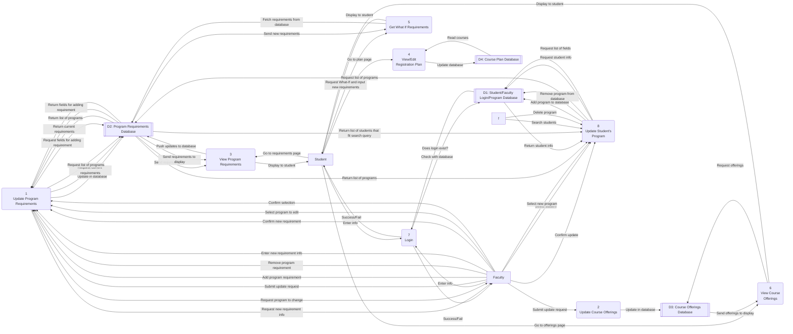
```mermaid
flowchart LR

d1[[D1: Student/Faculty Login/Program Database]]
d2[[D2: Program Requirements Database]]
d3[[D3: Course Offerings Database]]
d4[[D4: Course Plan Database]]
a1[Student]
a2[Faculty]
1(1\nUpdate Program Requirements)
2(2\nUpdate Course Offerings)
3(3\nView Program Requirements)
4(4\nView/Edit\nRegistration Plan)
5(5\nGet What If Requirements)
6(6\nView Course\nOfferings)
7(7\nLogin)
8(8\nUpdate Student's\nProgram)

a1 --Enter info --> 7 --Check with database--> d1 --Does login exist?--> 7
a2 --Enter info --> 7
7 --Success/Fail --> a1
7 --Success/Fail --> a2
a1 --Go to requirements page--> 3
d2 --Send requirements--> 3
a1 --Go to plan page--> 4 --Update database--> d4
d4 --Read courses-->4
3 --Push updates to database--> d2 --Send requirements to display--> 3 --Display to student--> a1
a1 --Go to offerings page--> 6 --Request offerings--> d3 --Send offerings to display--> 6 --Display to student--> a1
a2 --Submit update request--> 1 --Update in database-->d2
a2 --Submit update request--> 2 --Update in database-->d3
a2 --Confirm update-->8--Add program to database-->d1
8 --Remove program from database-->d1
a2 --Select student-->8
a2 --Select new program--> 8
8 --Request list of programs--> d2
d2 --Return list of programs--> 8
a1--Request What-If and input new requirements-->5--Fetch requirements from database-->d2--Send new requirements-->5--Display to student-->a1
d2--Return current requirements-->1
1--Request current requirements-->d2
8--Request student info -->d1
d1--Return student info -->8
a2--Add program requirement-->1
a2--Remove program requirement-->1
1--Request new requirement info -->a2
a2--Enter new requirement info -->1
a2--Confirm new requirement-->1
1--Request program to change-->a2--Select program to edit-->1
1--Request list of programs-->d2--Return list of programs-->1
a2--Confirm selection--> 1
1--Request fields for adding requirement-->d2
d2--Return fields for adding requirement-->1
d2--Return list of students that fit search query-->8
f--Search students-->8
f--Delete program-->8
8--Request list of fields-->d1
```

Level 2, Process 1:
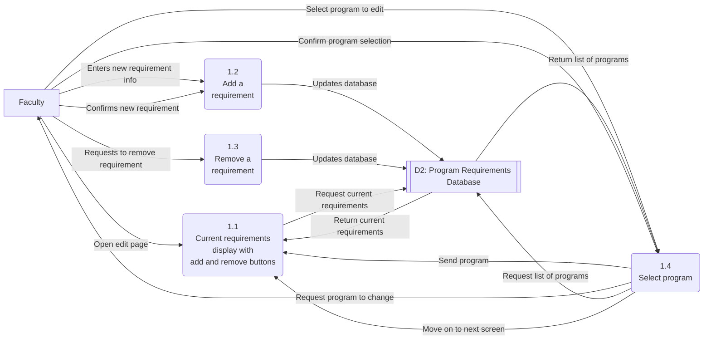
```mermaid
flowchart LR

f[Faculty]
d2[[D2: Program Requirements Database]]
1.1(1.1 \n Current requirements \n display with \n add and remove buttons)
1.2(1.2 \n Add a \n requirement)
1.3(1.3 \n Remove a \n requirement)
1.4(1.4 \n Select program)

1.4--Send program-->1.1
f --Open edit page--> 1.1
f --Enters new requirement info --> 1.2
f --Confirms new requirement--> 1.2
f --Requests to remove requirement--> 1.3
1.2 --Updates database-->d2
1.3 --Updates database-->d2
d2 --Return current requirements--> 1.1
1.1 --Request current requirements--> d2
1.4 --Request program to change--> f --Select program to edit--> 1.4
1.4 --Request list of programs--> d2 --Return list of programs --> 1.4
1.4 --Move on to next screen--> 1.1
f --Confirm program selection--> 1.4
```

Level 3, Process 1.1:
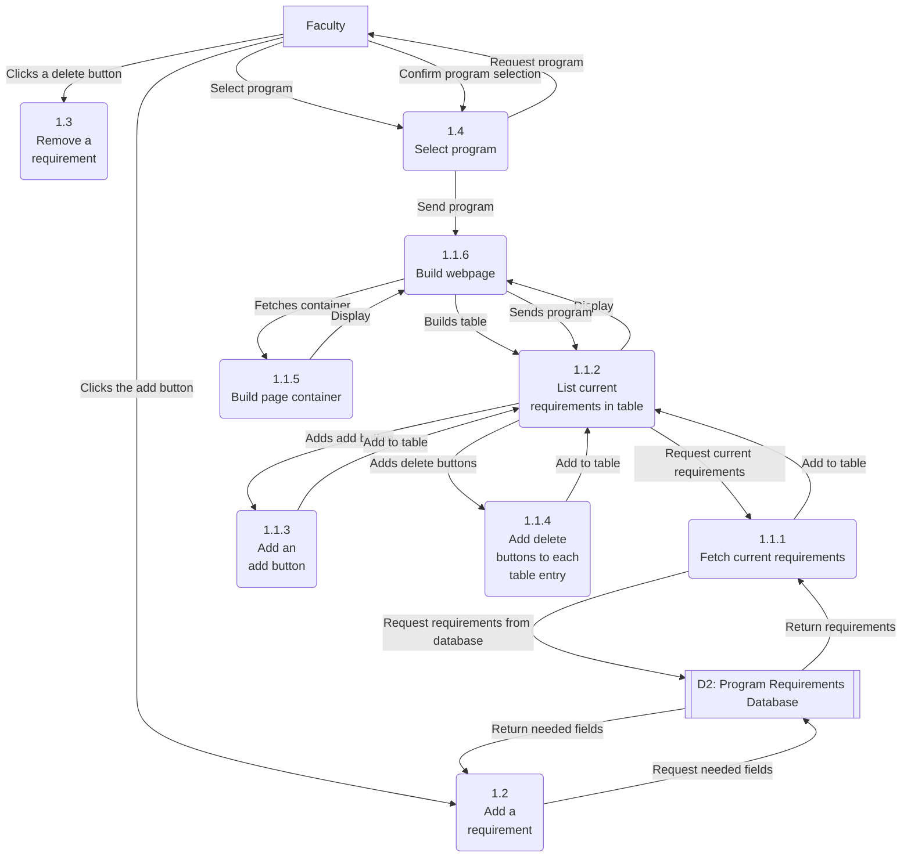
```mermaid
flowchart TD 

f[Faculty]
d2[[D2: Program Requirements Database]]
1.2(1.2 \n Add a \n requirement)
1.3(1.3 \n Remove a \n requirement)
1.1.1(1.1.1 \n Fetch current requirements)
1.1.2(1.1.2 \n List current \n requirements in table)
1.1.3(1.1.3 \n Add an \n add button)
1.1.4(1.1.4 \n Add delete \n buttons to each \n table entry)
1.1.5(1.1.5 \n Build page container)
1.1.6(1.1.6 \n Build webpage)
1.4(1.4 \n Select program)

1.4 --Request program--> f
f --Select program--> 1.4
f --Confirm program selection--> 1.4
1.4 --Send program-->1.1.6
1.1.6 --Fetches container--> 1.1.5 --Display --> 1.1.6
1.1.6 --Builds table--> 1.1.2 --Display--> 1.1.6
1.1.2 --Adds add button--> 1.1.3 --Add to table--> 1.1.2
1.1.2 --Adds delete buttons--> 1.1.4 --Add to table--> 1.1.2
1.1.2 --Request current requirements--> 1.1.1 --Add to table--> 1.1.2
1.1.1 --Request requirements from database--> d2 --Return requirements--> 1.1.1
f --Clicks the add button--> 1.2
f --Clicks a delete button--> 1.3
1.1.6 --Sends program--> 1.1.2
1.2 --Request needed fields--> d2
d2 --Return needed fields--> 1.2
```

Level 4, Process 1.1.1
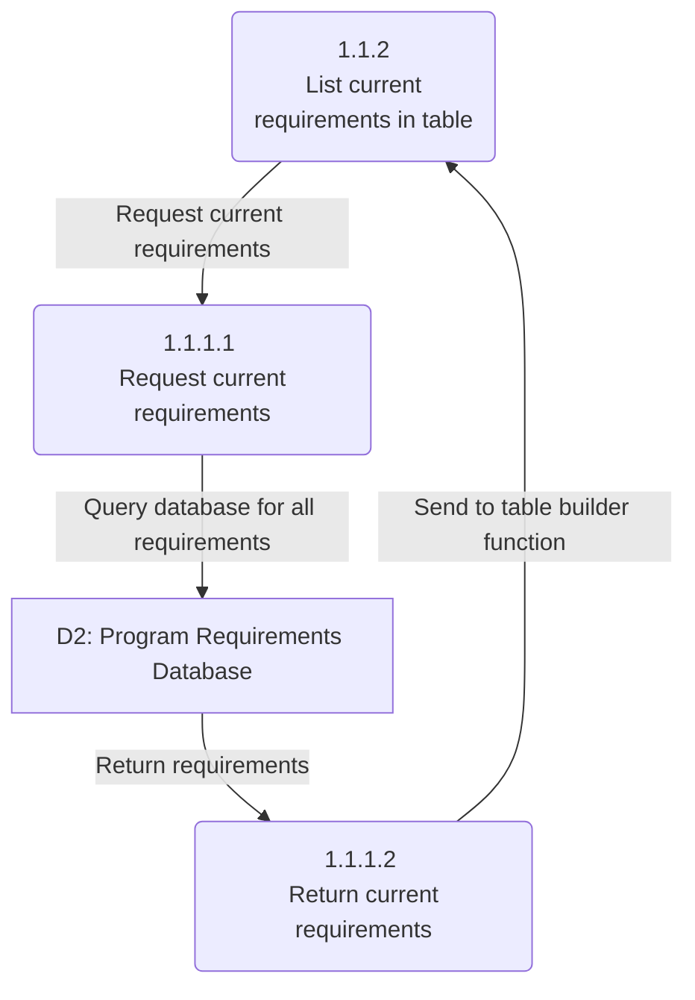
```mermaid
flowchart TD

1.1.2(1.1.2 \n List current \n requirements in table)
d2[D2: Program Requirements Database]
1.1.1.1(1.1.1.1 \n Request current requirements)
1.1.1.2(1.1.1.2 \n Return current requirements)

1.1.2 --Request current requirements--> 1.1.1.1
1.1.1.1 --Query database for all requirements--> d2
d2 --Return requirements --> 1.1.1.2
1.1.1.2 --Send to table builder function--> 1.1.2
```

Level 4, Process 1.1.2
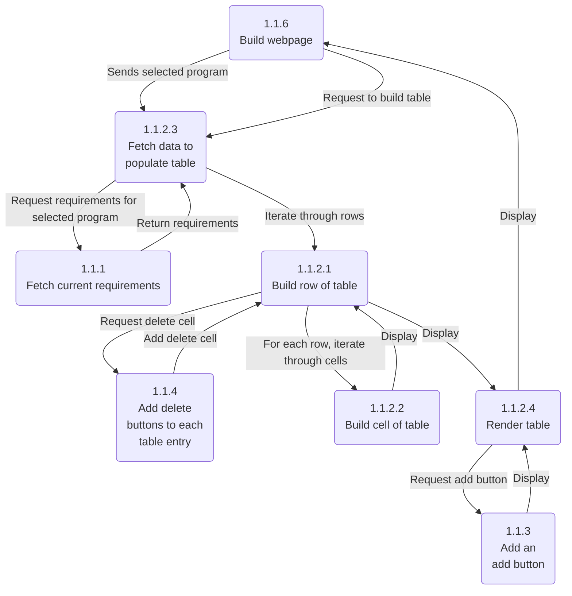
```mermaid
flowchart TD

1.1.6(1.1.6 \n Build webpage)
1.1.4(1.1.4 \n Add delete \n buttons to each \n table entry)
1.1.3(1.1.3 \n Add an \n add button)
1.1.1(1.1.1 \n Fetch current requirements)
1.1.2.1(1.1.2.1 \n Build row of table)
1.1.2.2(1.1.2.2 \n Build cell of table)
1.1.2.3(1.1.2.3 \n Fetch data to \n populate table)
1.1.2.4(1.1.2.4 \n Render table)

1.1.6 --Sends selected program--> 1.1.2.3
1.1.6 --Request to build table--> 1.1.2.3
1.1.2.3 --Request requirements for selected program--> 1.1.1
1.1.2.3 --Iterate through rows--> 1.1.2.1
1.1.2.1 --For each row, iterate through cells--> 1.1.2.2
1.1.2.2 --Display--> 1.1.2.1
1.1.2.1 --Request delete cell--> 1.1.4
1.1.4 --Add delete cell--> 1.1.2.1
1.1.2.1 --Display--> 1.1.2.4
1.1.2.4 --Request add button --> 1.1.3
1.1.3 --Display--> 1.1.2.4
1.1.2.4 --Display--> 1.1.6
1.1.1 --Return requirements--> 1.1.2.3
```

Level 5, Process 1.1.2.1
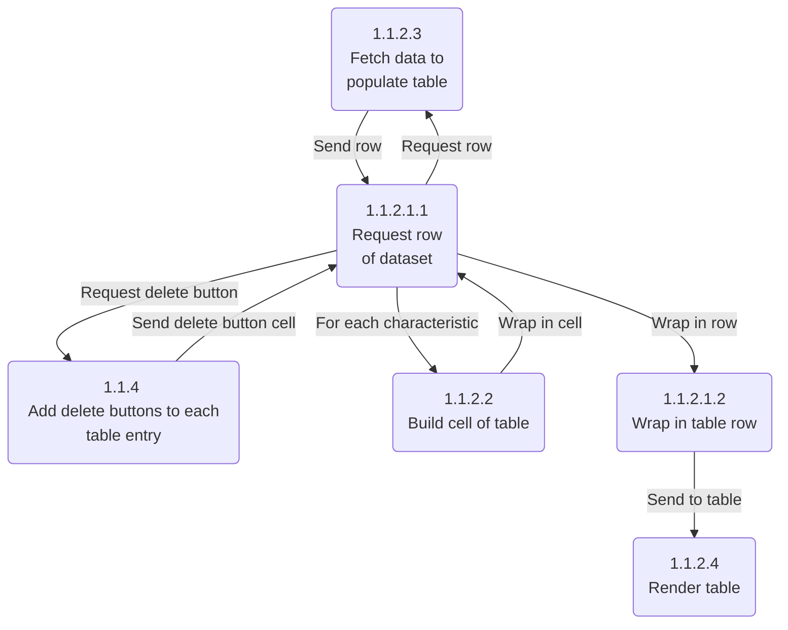
```mermaid
flowchart TD

1.1.2.3(1.1.2.3 \n Fetch data to \n populate table)
1.1.4(1.1.4 \n Add delete buttons to each table entry)
1.1.2.2(1.1.2.2 \n Build cell of table)
1.1.2.4(1.1.2.4 \n Render table)
1.1.2.1.1(1.1.2.1.1 \n Request row \n of dataset)
1.1.2.1.2(1.1.2.1.2 \n Wrap in table row)

1.1.2.1.1 --For each characteristic--> 1.1.2.2
1.1.2.2 --Wrap in cell--> 1.1.2.1.1
1.1.2.1.1 --Request delete button--> 1.1.4
1.1.4 --Send delete button cell--> 1.1.2.1.1
1.1.2.1.1 --Wrap in row--> 1.1.2.1.2
1.1.2.3 --Send row--> 1.1.2.1.1
1.1.2.1.1 --Request row--> 1.1.2.3
1.1.2.1.2 --Send to table--> 1.1.2.4
```

Level 5, Process 1.1.2.2
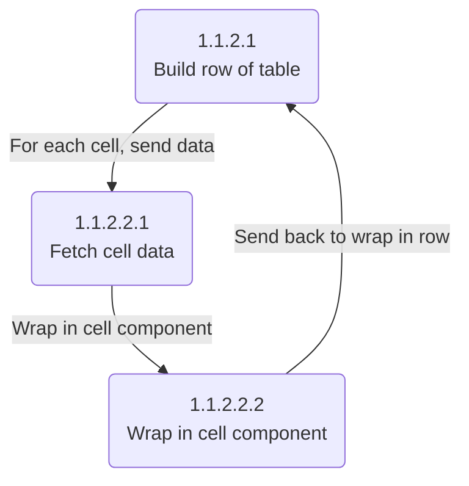
```mermaid
flowchart TD

1.1.2.1(1.1.2.1 \n Build row of table)
1.1.2.2.1(1.1.2.2.1 \n Fetch cell data)
1.1.2.2.2(1.1.2.2.2 \n Wrap in cell component)

1.1.2.1 --For each cell, send data--> 1.1.2.2.1
1.1.2.2.1 --Wrap in cell component--> 1.1.2.2.2
1.1.2.2.2 --Send back to wrap in row--> 1.1.2.1
```

Level 5, Process 1.1.2.3
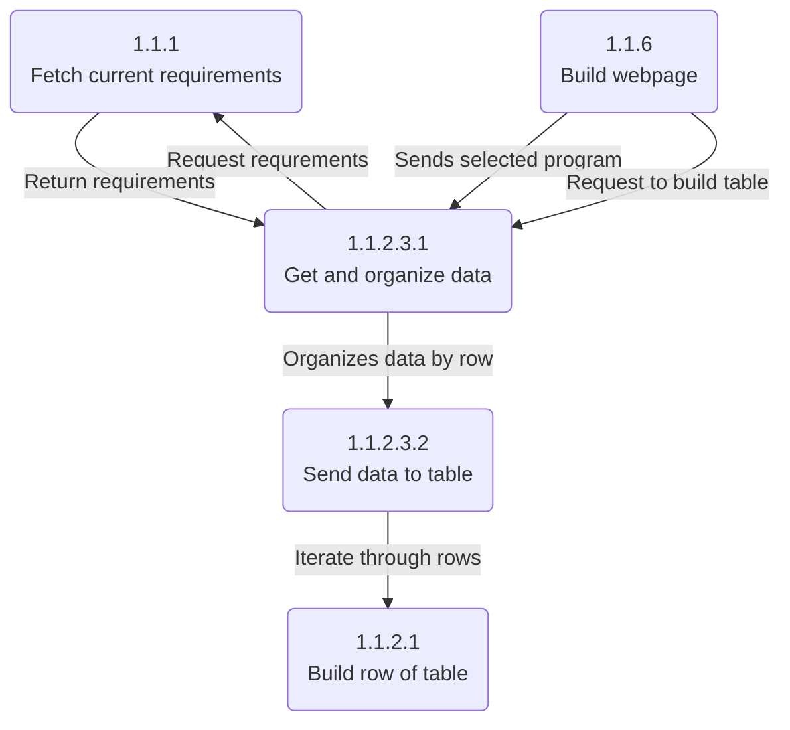
```mermaid
flowchart TD

1.1.1(1.1.1 \n Fetch current requirements)
1.1.6(1.1.6 \n Build webpage)
1.1.2.1(1.1.2.1 \n Build row of table)
1.1.2.3.1(1.1.2.3.1 \n Get and organize data)
1.1.2.3.2(1.1.2.3.2 \n Send data to table)

1.1.2.3.1 --Request requrements--> 1.1.1
1.1.1 --Return requirements--> 1.1.2.3.1
1.1.6 --Sends selected program--> 1.1.2.3.1
1.1.6 --Request to build table--> 1.1.2.3.1
1.1.2.3.1 --Organizes data by row--> 1.1.2.3.2
1.1.2.3.2 --Iterate through rows--> 1.1.2.1
```

Level 5, Process 1.1.2.4
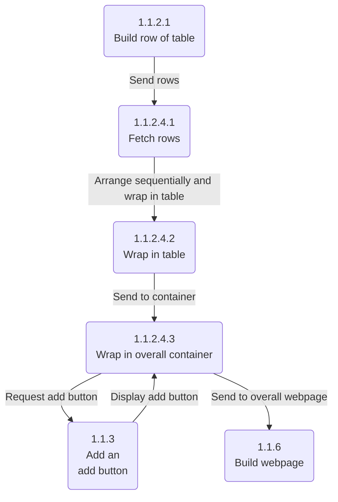
```mermaid
flowchart TD

1.1.2.1(1.1.2.1 \n Build row of table)
1.1.3(1.1.3 \n Add an \n add button)
1.1.6(1.1.6 \n Build webpage)
1.1.2.4.1(1.1.2.4.1 \n Fetch rows)
1.1.2.4.2(1.1.2.4.2 \n Wrap in table)
1.1.2.4.3(1.1.2.4.3 \n Wrap in overall container)

1.1.2.1 --Send rows--> 1.1.2.4.1
1.1.2.4.1 --Arrange sequentially and wrap in table--> 1.1.2.4.2
1.1.2.4.2 --Send to container--> 1.1.2.4.3
1.1.2.4.3 --Request add button--> 1.1.3
1.1.3 --Display add button--> 1.1.2.4.3
1.1.2.4.3 --Send to overall webpage --> 1.1.6
```

Level 4, Process 1.1.6:
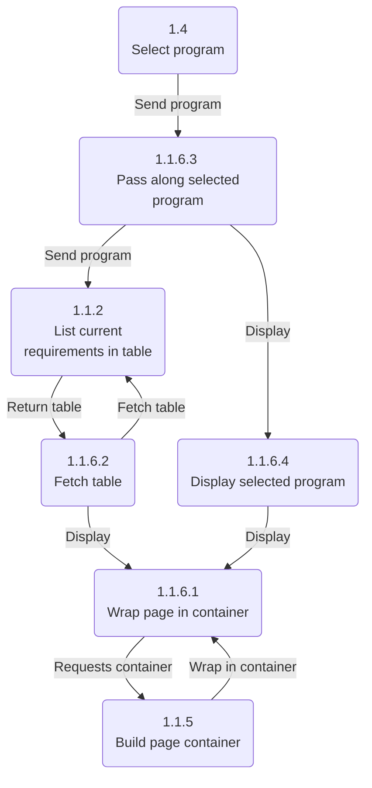
```mermaid
flowchart TD

1.4(1.4 \n Select program)
1.1.5(1.1.5 \n Build page container)
1.1.2(1.1.2 \n List current \n requirements in table)
1.1.6.1(1.1.6.1 \n Wrap page in container)
1.1.6.2(1.1.6.2 \n Fetch table)
1.1.6.3(1.1.6.3 \n Pass along selected program)
1.1.6.4(1.1.6.4 \n Display selected program)

1.4 --Send program--> 1.1.6.3 --Send program--> 1.1.2
1.1.6.3 --Display--> 1.1.6.4
1.1.6.2 --Fetch table--> 1.1.2 --Return table--> 1.1.6.2
1.1.6.2 --Display--> 1.1.6.1
1.1.6.4 --Display--> 1.1.6.1
1.1.5 --Wrap in container--> 1.1.6.1
1.1.6.1 --Requests container--> 1.1.5

```

Level 3, Process 1.2:
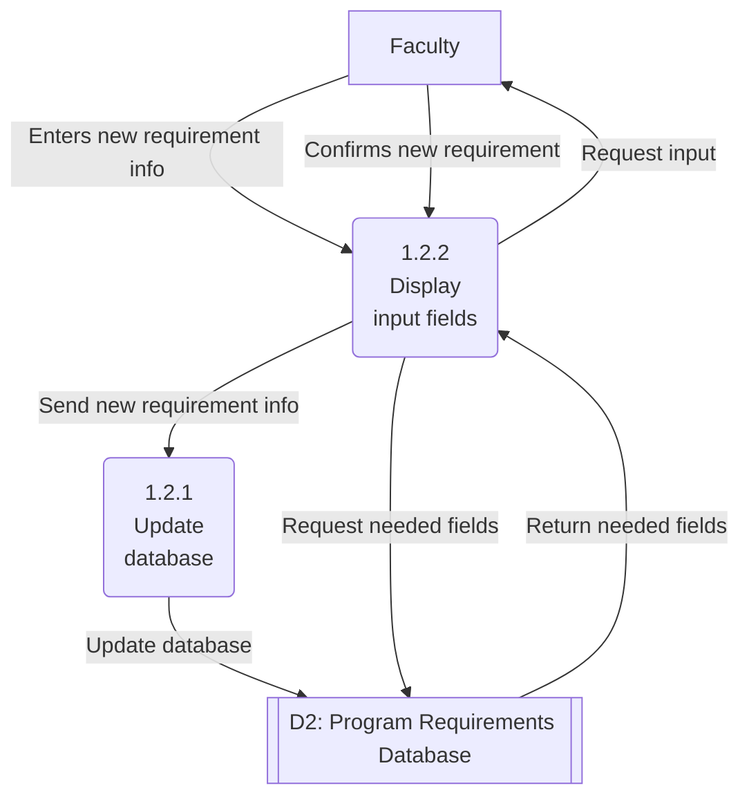
```mermaid
flowchart TD

f[Faculty]
d2[[D2: Program Requirements Database]]
1.2.1(1.2.1 \n Update \n database)
1.2.2(1.2.2 \n Display \n input fields)

f --Enters new requirement info --> 1.2.2
f --Confirms new requirement--> 1.2.2
1.2.2 --Request input--> f
1.2.2 --Send new requirement info --> 1.2.1
1.2.1 --Update database --> d2
1.2.2 --Request needed fields--> d2
d2 --Return needed fields --> 1.2.2
```

Level 4, Process 1.2.2:
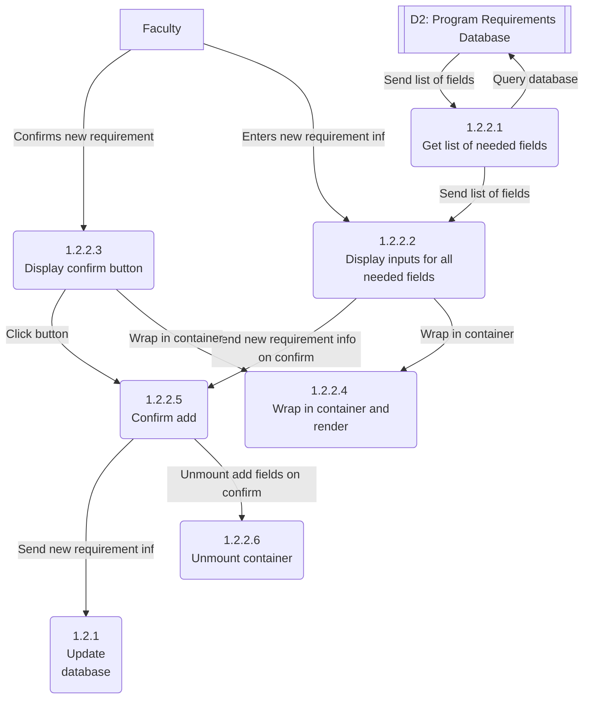
```mermaid
flowchart TD

f[Faculty]
d2[[D2: Program Requirements Database]]
1.2.2.1(1.2.2.1 \n Get list of needed fields)
1.2.2.2(1.2.2.2 \n Display inputs for all needed fields)
1.2.2.3(1.2.2.3 \n Display confirm button)
1.2.2.4(1.2.2.5 \n Confirm add)
1.2.2.5(1.2.2.6 \n Unmount container)
1.2.2.6(1.2.2.4 \n Wrap in container and render)
1.2.1(1.2.1 \n Update \n database)

f --Confirms new requirement--> 1.2.2.3
f --Enters new requirement info--> 1.2.2.2
1.2.2.1 --Send list of fields--> 1.2.2.2
1.2.2.2 --Send new requirement info on confirm--> 1.2.2.4
1.2.2.3 --Click button--> 1.2.2.4
1.2.2.4 --Send new requirement info--> 1.2.1
1.2.2.2 --Wrap in container--> 1.2.2.6
1.2.2.3 --Wrap in container--> 1.2.2.6
1.2.2.4 --Unmount add fields on confirm--> 1.2.2.5
1.2.2.1 --Query database--> d2
d2 --Send list of fields--> 1.2.2.1
```

Level 3, Process 1.3:
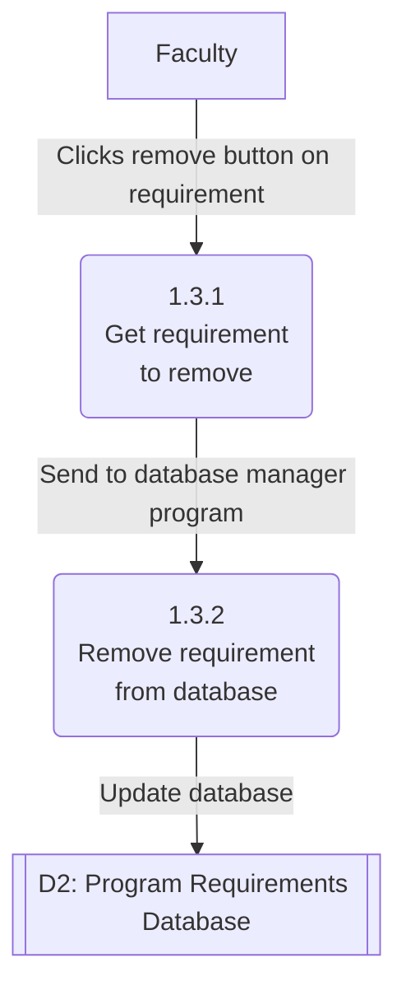
```mermaid
flowchart TD

f[Faculty]
d2[[D2: Program Requirements Database]]
1.3.1(1.3.1 \n Get requirement \n to remove)
1.3.2(1.3.2 \n Remove requirement \n from database)

f --Clicks remove button on requirement--> 1.3.1
1.3.1 --Send to database manager program--> 1.3.2
1.3.2 --Update database--> d2
```

Level 3, Process 1.4:
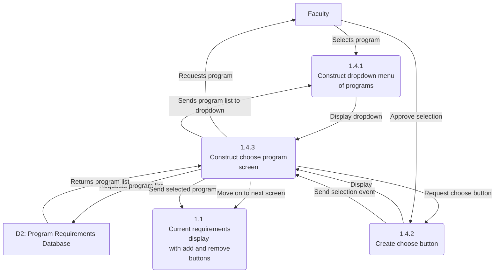
```mermaid
flowchart TD

f[Faculty]
1.1(1.1 \n Current requirements display \n with add and remove buttons)
1.4.1(1.4.1 \n Construct dropdown menu \n of programs)
1.4.2(1.4.2 \n Create choose button)
1.4.3(1.4.3 \n Construct choose program screen)
d2[D2: Program Requirements Database]

1.4.3 --Requests program--> f
f --Selects program--> 1.4.1
1.4.3 --Requests program list--> d2
d2 --Returns program list--> 1.4.3
1.4.3 --Sends program list to dropdown--> 1.4.1
1.4.1 --Display dropdown--> 1.4.3
1.4.3 --Request choose button--> 1.4.2
1.4.2 --Display--> 1.4.3
1.4.3 --Move on to next screen--> 1.1
1.4.3 --Send selected program--> 1.1
f --Approve selection--> 1.4.2
1.4.2 --Send selection event--> 1.4.3
```

Level 4, Process 1.4.3:
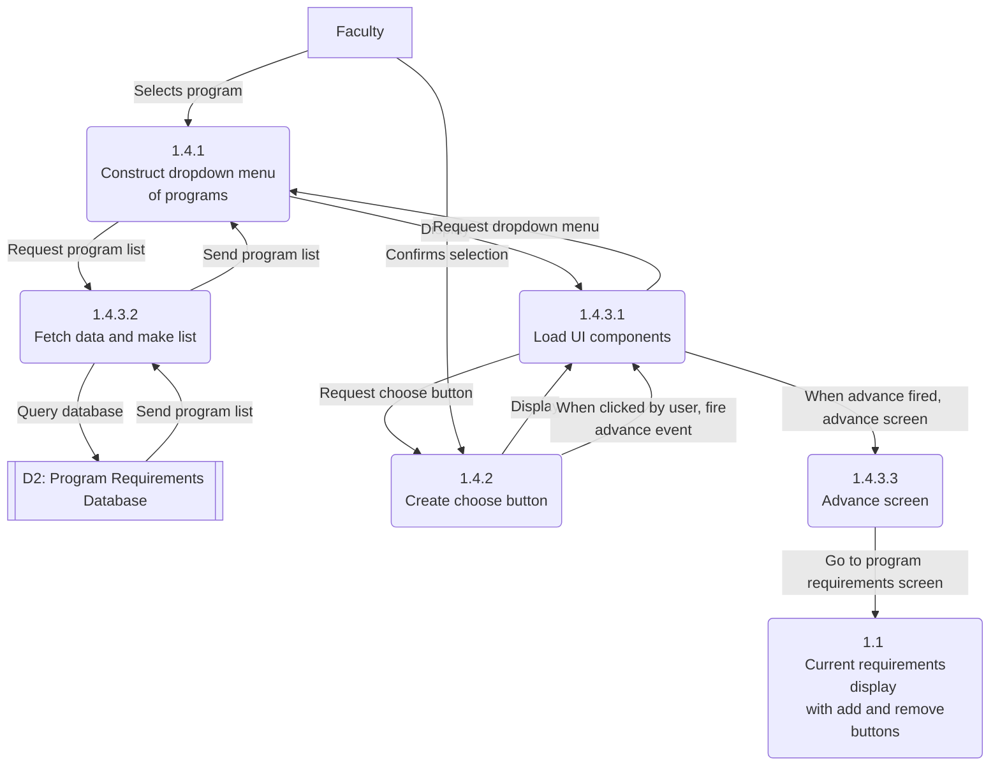
```mermaid
flowchart TD

f[Faculty]
d2[[D2: Program Requirements Database]]
1.4.1(1.4.1 \n Construct dropdown menu \n of programs)
1.4.2(1.4.2 \n Create choose button)
1.1(1.1 \n Current requirements display \n with add and remove buttons)
1.4.3.1(1.4.3.1 \n Load UI components)
1.4.3.2(1.4.3.2 \n Fetch data and make list)
1.4.3.3(1.4.3.3 \n Advance screen)

1.4.1 --Display--> 1.4.3.1
1.4.2 --Display--> 1.4.3.1
1.4.3.2 --Query database--> d2
d2 --Send program list--> 1.4.3.2
1.4.3.2 --Send program list--> 1.4.1
1.4.1 --Request program list--> 1.4.3.2
1.4.3.3 --Go to program requirements screen--> 1.1
1.4.2 --When clicked by user, fire advance event--> 1.4.3.1
1.4.3.1 --When advance fired, advance screen--> 1.4.3.3
1.4.3.1 --Request choose button--> 1.4.2
1.4.3.1 --Request dropdown menu--> 1.4.1
f --Selects program--> 1.4.1
f --Confirms selection--> 1.4.2
```

Level 5, Process 1.4.3.1
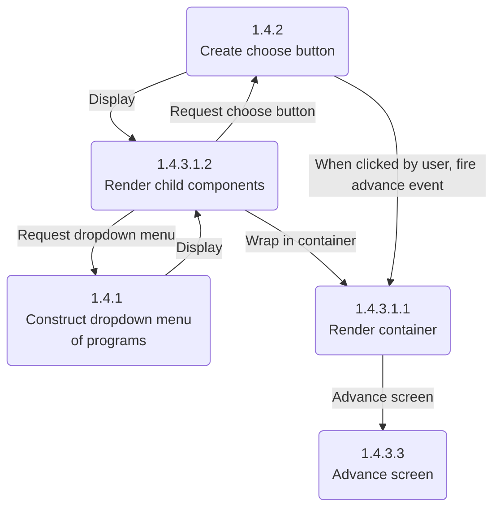
```mermaid
flowchart TD

1.4.2(1.4.2 \n Create choose button)
1.4.1(1.4.1 \n Construct dropdown menu of programs)
1.4.3.1.1(1.4.3.1.1 \n Render container)
1.4.3.1.2(1.4.3.1.2 \n Render child components)
1.4.3.3(1.4.3.3 \n Advance screen)

1.4.3.1.2 --Request dropdown menu--> 1.4.1
1.4.1 --Display--> 1.4.3.1.2
1.4.3.1.2 --Request choose button--> 1.4.2
1.4.2 --Display--> 1.4.3.1.2
1.4.3.1.2 --Wrap in container--> 1.4.3.1.1
1.4.2 --When clicked by user, fire advance event--> 1.4.3.1.1
1.4.3.1.1 --Advance screen--> 1.4.3.3
```

Level 5, Process 1.4.3.2
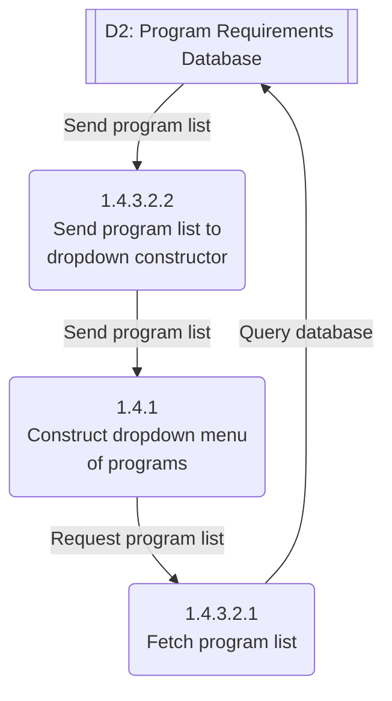
```mermaid
flowchart TD

d2[[D2: Program Requirements Database]]
1.4.1(1.4.1 \n Construct dropdown menu \n of programs)
1.4.3.2.1(1.4.3.2.1 \n Fetch program list)
1.4.3.2.2(1.4.3.2.2 \n Send program list to \n dropdown constructor)

1.4.1 --Request program list--> 1.4.3.2.1
1.4.3.2.1 --Query database --> d2
d2 --Send program list--> 1.4.3.2.2
1.4.3.2.2 --Send program list--> 1.4.1
```

Level 5, Process 1.4.3.3
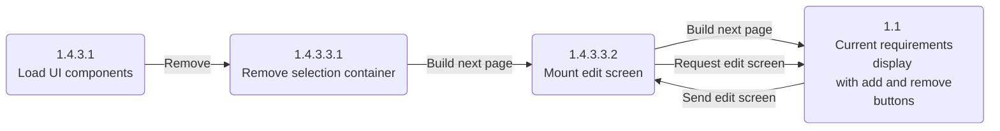
```mermaid
flowchart LR

1.4.3.1(1.4.3.1 \n Load UI components)
1.1(1.1 \n Current requirements display \n with add and remove buttons)
1.4.3.3.1(1.4.3.3.1 \n Remove selection container)
1.4.3.3.2(1.4.3.3.2 \n Mount edit screen)

1.4.3.1 --Remove--> 1.4.3.3.1
1.4.3.3.1 --Build next page--> 1.4.3.3.2
1.4.3.3.2 --Build next page--> 1.1
1.4.3.3.2 --Request edit screen--> 1.1
1.1 --Send edit screen--> 1.4.3.3.2
```

Level 2, Process 8:
```mermaid
flowchart TD

f[Faculty]
d1[[D1: Student/Faculty Login/Program Database]]
d2[[D2: Program Requirements Database]]
8.1(8.1 \n Select student)
8.2(8.2 \n Display program editor page)
8.3(8.3 \n Add program)
8.4(8.4 \n Remove program)
8.5(8.5 \n Send New Program to Database)

f --Go to update program page--> 8.1
f --Select student--> 8.1
f --Select new program--> 8.2
f --Confirm update--> 8.2
f --Search students--> 8.1
f --Confirm delete--> 8.2
8.1 --Request student info --> d1
8.1 --Show program list and dropdown--> 8.2
d1 --Return student info --> 8.1
8.1 --Send student info --> 8.2
8.2 --User selects a program and clicks add--> 8.3
8.3 --Update database--> 8.5
8.2 --User clicks delete button on a program--> 8.4
8.4 --Update database--> 8.5
8.5 --Add program database--> d1
8.5 --Remove program from database--> d1
8.2 --Request list of programs--> d2
d2 --Return list of programs--> 8.2
d1 --Return list of students the fit search query--> 8.1
8.1 --Send student info --> 8.5
8.1 --Request list of fields--> d1
```

Level 3, Process 8.1:
```mermaid
flowchart TD

f[Faculty]
d1[[D1: Studuent/Faculty Login/Program Database]]
8.2(8.2 \n Display program editor page)
8.1.1(8.1.1 \n Build student search form)
8.1.2(8.1.2 \n Search database for student)
8.1.3(8.1.3 \n Show rest of page)
8.5(8.5 \n Send new program to database)

f --Search student--> 8.1.1
8.1.1 --On search, query database--> 8.1.2
f --Go to page--> 8.1.1
8.1.2 --Request student info --> d1
d1 --Return list of students that fit search query--> 8.1.2
8.1.2 --Send list of students--> 8.1.1
f --Select student--> 8.1.1
8.1.1 --When a student is selected, advance screen--> 8.1.3
8.1.3 --Show program editor and update for correct student--> 8.2
8.1.3 --Send student info --> 8.2
8.1.1 --When student selected, send info --> 8.5
8.1.1 --Request list of fields--> d1
d1 --Return list of fields--> 8.1.1
```

Level 4, Process 8.1.1
```mermaid
flowchart TD

f[Faculty]
d1[[D1: Student/Faculty Login/Program Database]]
8.1.2(8.1.2 \n Search database for student)
8.1.3(8.1.3 \n Show rest of page)
8.5(8.5 \n Send new program to database)
8.1.1.1(8.1.1.1 \n Get list of columns \n from database)
8.1.1.2(8.1.1.2 \n Add fields for each column)
8.1.1.3(8.1.1.3 \n Add selectable list of students)

f --Update input field--> 8.1.1.2
f --Go to page--> 8.1.1.2
8.1.1.2 --On search, search the database--> 8.1.2
8.1.2 --Return list of students--> 8.1.1.3
8.1.1.1 --Request list of columns--> d1
d1 --Return list of columns--> 8.1.1.1
8.1.1.2 --Request list of columns--> 8.1.1.1
8.1.1.1 --Return list of columns--> 8.1.1.2
f --Select student--> 8.1.1.3
8.1.1.3 --On select, show/update rest of page--> 8.1.3
8.1.1.3 --When student selected, make student info \n available to database updater--> 8.5
8.1.1.2 --Trigger add student list on search--> 8.1.1.3
```

Level 5, Process 8.1.1.1:
```mermaid
flowchart TD

8.1.1.2(8.1.1.2 \n Add fields for each column)
8.1.1.1.1(8.1.1.1.1 \n Request list of columns)
d1[[D1: Student/Faculty Login/Program Database]]
8.1.1.1.2(8.1.1.1.2 \n Receive list of columns)

8.1.1.2 --Request list of columns--> 8.1.1.1.1 --Query database--> d1 --Return list of columns--> 8.1.1.1.2 --Return list of columns--> 8.1.1.2
```

Level 5, Process 8.1.1.3:
```mermaid
flowchart TD

f[Faculty]
8.1.2(8.1.2 \n Search database for student)
8.1.3(8.1.3 \n Show rest of page)
8.5(8.5 \n Send new program to database)
8.1.1.2(8.1.1.2 \n Add fields for each column)
8.1.1.3.1(8.1.1.3.1 \n Wrap in container)
8.1.1.3.2(8.1.1.3.2 \n Display list)
8.1.1.3.3(8.1.1.3.3 \n Make selectable)

f --Select student--> 8.1.1.3.3
8.1.2 --Send list of students--> 8.1.1.3.2
8.1.1.3.2 --Add click handles--> 8.1.1.3.3
8.1.1.2 --Show student list on search--> 8.1.1.3.1
8.1.1.3.1 --Request list--> 8.1.1.3.2
8.1.1.3.2 --Display list--> 8.1.1.3.1
8.1.1.3.3 --On click--> 8.1.3
8.1.1.3.3 --On click, make student info \n available to database updater--> 8.5
```

Level 4, Process 8.1.2:
```mermaid
flowchart TD

8.1.1(8.1.1 \n Build student search form)
d1[[D1: Student/Faculty Login/Program Database]]
8.1.2.1(8.1.2.1 \n Query database with search term)
8.1.2.2(8.1.2.2 \n Return students)

8.1.1 --Request list of students that meet search query-->8.1.2.1 --Query database--> d1 --Return students--> 8.1.2.2 --Return students--> 8.1.1
```

Level 3, Process 8.2:
```mermaid
flowchart TD

f[Faculty]
d2[[D2: Program Requirements Database]]
8.1(8.1 \n Select student)
8.3(8.3 \n Add program)
8.4(8.4 \n Remove program)
8.2.1(8.2.1 \n Display list of current \n programs for student)
8.2.2(8.2.2 \n Display program dropdown)
8.2.4(8.2.4 \n Add delete buttons \n to programs)
8.2.3(8.2.3 \n Display add button)
8.2.5(8.2.5 \n Wrap in container)

8.1 --Send student program data--> 8.2.1
8.1 --Request page--> 8.2.5
8.2.2 --Request program list--> d2
d2 --Return program list--> 8.2.2
8.2.3 --Display in conatiner--> 8.2.5
8.2.1 --Request delete buttons--> 8.2.4
8.2.4 --Add to list--> 8.2.1
f --Clicks delete button--> 8.2.4
8.2.4 --On click, delete program--> 8.4
8.2.5 --Request program dropdown--> 8.2.2
8.2.2 --Display in container--> 8.2.5
8.2.1 --Display in container--> 8.2.5
8.2.5 --Request add button--> 8.2.3
f --Clicks add button--> 8.2.3
8.2.3 --On click, add selected program--> 8.3
f --Selects program in dropdown--> 8.2.2
```

Level 4, Process 8.2.1:
```mermaid
flowchart TD

8.2.4(8.2.4 \n Add delete buttons \n to programs)
8.1(8.1 \n Select student)
8.2.5(8.2.5 \n Wrap in container)
8.2.1.1(8.2.1.1 \n Build row)
8.2.1.2(8.2.1.2 \n Wrap in table)

8.1 --Iterate through list of programs for student--> 8.2.1.1
8.2.1.1 --Request delete button--> 8.2.4
8.2.4 --Display delete button--> 8.2.1.1
8.2.1.1 --Send to table--> 8.2.1.2
8.2.1.2 --Send to container--> 8.2.5
```

Level 4, Process 8.2.2:
```mermaid
flowchart TD

f[Faculty]
d2[[D2: Program Requirements Database]]
8.2.5(8.2.5 \n Wrap in container)
8.2.2.1(8.2.2.1 \n Build dropdown)
8.2.2.2(8.2.2.2 \n Request program \n list from database)

f --Selects program--> 8.2.2.1
8.2.2.1 --Request list of programs--> 8.2.2.2
8.2.2.1 --Send to container--> 8.2.5
8.2.5 --Request program dropdown--> 8.2.2.1
8.2.2.2 --Request programs from database--> d2
d2 --Return list of programs--> 8.2.2.2
8.2.2.2 --Send list of programs--> 8.2.2.1
```

Level 5, Process 8.2.2.2:
```mermaid
flowchart TD

8.2.2.1(8.2.2.1 \n Display program editor page)
8.2.2.2.1(8.2.2.2.1 \n Request list of programs)
d2[[D2: Program Requirements Database]]
8.2.2.2.2(8.2.2.2.2 \n Receive list of programs)

8.2.2.1 --Request list of programs--> 8.2.2.2.1 --Query database--> d2 --Return list of programs--> 8.2.2.2.2 --Return list of programs--> 8.2.2.1
```

Level 3, Process 8.3:
```mermaid
flowchart LR

8.2(8.2 \n Display program editor page)
8.5(8.5 \n Send new program to database)
8.3.1(8.3.1 \n Receive program \n from user)
8.3.2(8.3.2 \n Send program to \n database updater function)

8.2 --Send new program--> 8.3.1 --Send new program--> 8.3.2 --Send new program--> 8.5
```

Level 3, Process 8.4:
```mermaid
flowchart LR

8.2(8.2 \n Display program editor page)
8.5(8.5 \n Send new program to database)
8.4.1(8.3.1 \n Receive program to \n remove from user)
8.4.2(8.3.2 \n Send program to \n database updater function)

8.2 --Send program to remove--> 8.4.1 --Send program to remove--> 8.4.2 --Send program to remove--> 8.5
```

Level 3, Process 8.5:
```mermaid
flowchart LR
8.1(8.1 \n Select student)
8.3(8.3 \n Add program)
8.4(8.4 \n Remove program)
d1[[D1: Student/Faculty Login/Program Database]]
8.5.1(8.5.1 \n Add program to database)
8.5.2(8.5.2 \n Remove program from database)
8.5.3(8.5.3 \n Send student info \n to appropriate function)

8.3 --Request to add to database--> 8.5.1
8.5.1 --Run add query--> d1
8.4 --Request to remove from database--> 8.5.2
8.5.2 --Run remove query--> d1
8.1 --Send selected student--> 8.5.3
8.5.3 --Send student info --> 8.5.1
8.5.3 --Send student info --> 8.5.2
8.5.1 --Request student info --> 8.5.3
8.5.2 --Request student info --> 8.5.3
```

Level 4, Process 8.5.3
```mermaid
flowchart TD

8.5.1(8.5.1 \n Add program to database)
8.5.2(8.5.2 \n Remove program from database)
8.1(8.1 \n Select student)
8.5.3.1(8.5.3.1 \n Store student info)
8.5.3.2(8.5.3.2 \n Return student info)

8.5.1 --Request student info --> 8.5.3.2
8.5.2 --Request student info --> 8.5.3.2
8.5.3.2 --Return student info --> 8.5.1
8.5.3.2 --Return student info --> 8.5.2
8.1 --Store here--> 8.5.3.1
8.5.3.2 --Request stored info --> 8.5.3.1
8.5.3.1 --Return stored info --> 8.5.3.2
```

### 5.4 Data Model (Entity Relationship Diagram)
> *Reference Chapter 5*

> A set of data models and descriptions for the to‐be system. This may include data models of the as‐is system that will be replaced.

### 5.4 Structure Chart Diagram
> *Reference Chapter 9*

## 6. Appendices

### Research done on the existing system:
Messiah’s current course registration system is managed by a third party, namely Ellucian, and the registration program is not the only one they provide. After exploring Ellucian’s website, it seems apparent that Messiah uses “Ellucian Banner Student” which provides not only course registration and planning, but also the entire self-service website, which includes financial aid info, holds, transcript forms, transfer forms, and more. Additionally, Ellucian does not appear to offer components of this system separately. By exploring the self-service website myself, it appears very comprehensive and also very intertwined with the course registration pages. There is also a lot of benefit gained by having the course registration system interact with the finance system, transcript generators, and other programs, so to a point this makes sense. However, it also makes our job far more difficult. There are, however, likely at least four possible solutions to this problem.

Firstly, we could expand the scope of our project to include all services currently supplied by Ellucian. The self-service website is perhaps even more poorly designed than the registration system, so there would be a benefit to doing this. However, doing this would dramatically extend the timeline of the project, as it requires a massive amount of additional work. Additionally, storing financial aid data needs even more security than student schedules, which none of us are prepared to implement.

Another possible solution would be to actually scale down the project and interface with the existing system rather than replace it. This would require us to provide a new user interface and logic but use the existing database. There is some evidence that this approach may be possible through the Banner Student API, however it does appear quite limited, and as students we probably wouldn’t be able to get access to it. This would also not save Messiah any money and would actually make it more expensive due to the need to both host our web interface and keep paying Ellucian, so the only business value created would be that of students that decide to stay at Messiah that would not had it not been for our system.

A third possible solution would be to keep the scope of the project as-is. With this approach, Messiah would need to find a new solution for things like financial aid and other components of the self-service system. We could then increase the scope of the project slightly to include components of the website that Messiah cannot find a replacement for. The main disadvantage of this approach is that Messiah has to be willing to do the work to search for a new provider, and due to using multiple partners integration would suffer.

A fourth solution would entail building the new system as planned, just without the ability to register directly from our system. Instead we could include a feature to export a list of course reference numbers to streamline registration with the existing system. This would still allow us to replace the frontend for The View and DegreeWorks. This solution has similar problems as solution 2 in that it requires maintaining and paying for two systems, but may be better in that we aren’t limited by the use of a third-party API. The problem with this is that, once again, integration suffers and faculty may need to input course data both into our system and into the Ellucian system. That being said, with eCarps the Engineering department either already does this or has some way of doing both at once, so it appears feasible that faculty might be willing to do this. With this approach it does not directly replace systems, so business value is limited, though it would still dramatically improve the student experience, which could implicitly provide value.

It does appear that our system would provide value fairly quickly. Messiah already has a domain name (messiah.edu) and as such that cost is covered. The university may need to pay for additional server space to host the database and perhaps hire people to maintain it and keep it secure, however space in the cloud is not that expensive these days, especially compared to student tuition. Messiah likely obtains about $30000 on average per student per year (that value is found by taking full cost of attendance minus institutional scholarships and grants, though it is a very rough estimate), and with the current cost of server space, it’s unlikely that it would cost more than even one student’s tuition. As such, while the setback of a lack of integration will require some thinking about how to move forward with this project, it does not mean the project is completely infeasible or not valuable.

### Results of Interview with Dr. Van Dyke
What problems have you encountered with the current course registration system/why did you decide to create ecarps for the university?

> There was no way to plan students' full four year schedule so we would end up getting into places where students wouldn’t graduate on time. We used to do it on paper, but then moved it to electronics. It used to be a lot simpler, but since then more flexibility has created more difficulty. The chair wanted this so he could plan how many students will be taking each class every semester.

Have you experienced any difficulties in preparing students for their course registration as an advisor?

> One issue is that eCarps isn’t official, so then students start to rely on it and don’t look at their degree audit and have created issues in the past.

Explain briefly how far you’ve gone in your own course planning system.
> Students can keep track of a 4 year plan, keep track of prerequisites and total credits and university requirements. Total credits per semester, availability for all engineering courses, nothing with gen eds. Also has a scheduling system where students can plan which section they want for their schedule.

What problems have you encountered when designing your system?
> Two things to be aware of FERPA, since it contains student records and it is not public information. People's schedules are protected by FERPA meaning that people need to sign in. Advisors can't see schedules unless their students or if there is a reason. Another thing is you probably cannot get access to the banner, someone has to maintain it AKA the chair. In order for this to work someone has to be dedicated to it. Also they are getting rid of Banner so next year it would be really difficult to get tied in.

Do you handle any of the student records/something that is confidential?
> Yeah, only as the role of IT/the owner, other advisors cannot see anything they don’t have access to.

How easy is it to gain access to all major/minor/concentration information (what classes are required)?
> The information is there (all in the catalog) not in a convenient form. We would have to talk to IT to get the information from Banner.

How different is the data between The View course schedule and the Course Catalog from Ellucian and eCarps?
> To get the scheduling information, professor Van Dyke web scraped the View.

How are curriculums changed within each department (or at least the ENGR department)?
> The chair makes a proposal, many committees, the chair of the department would have the best knowledge.

As Ellucian comes as a package, this project may need to work as an addition to what Messiah already pays to Ellucian. How cost intensive do you imagine a project with the scope of creating an additional software would be?
> In terms of labor, it costs a lot. In terms of additional software mostly free.

How feasible would it be to use the database associated with the Ellucian system into a new system?
> API access possibly all has to do with if they give us permission to do it or not.

How much do you need to change semester over semester/how much work do you put in between semesters?
> Not many changes in curriculums only change 1 time per year, not semester. Just for maintenance, probably 5 hours.

How much do you get paid to do eCarps?
> None extra officially, counts as service to the college

Would you recommend this assignment as an idea for students, state your reasoning?
> No, But you should make an app for symposium with a schedule for maps and what event you should go to, things like where to go, what to do and when to do it, zoom links for zoom meeting and stuff.

### Results of Interview with Dr. Suberi
What problems have you encountered with the current course registration system?
> No other administrative problems 
> Changes in the view may not show up on your system

Have you experienced any difficulties in preparing students for their course registration as an advisor?
> Manually have to find out how many students are planning on taking a class 
> Have to segregate files of graduated students 
> Help department chair with staffing

What problems have you encountered when designing your system?
> Other than getting access to data, it has gone fairly smoothly
