# System Request Document

> Matthew - Gantt Chart
> Caleb - Data Model
> Garret - Executive Summary/Sequence Diagram
> Cheng Eu - Structure Chart

## Table of Contents

1. System Request
2. Work Plan
3. Feasibility Analysis
   1. Technical Feasibility
   2. Organizational Feasibility
4. Requirements Definition
   1. Functional Requirement
   2. Non-functional Requirement
5. Logical Design
   1. Sequence Diagram
   2. Use Cases
   3. Process Modeling (Data Flow Diagram)
      1. Level 0 Diagram
      2. Level 1 Diagram
      3. Level 2 Diagram
      4. Level 3 Diagram
      5. Level 4 Diagram
      6. Level 5 Diagram
   4. Data Modeling (Entity Relationship Diagram)
   5. Structure Chart Diagram
6. Appendices

## Executive Summary
> A summary of all the essential information in the proposal so that a busy executive can read it quickly and decide what parts of the plan to read in more depth.

## 1. System Request

- **Project Sponsors:** Cheng Eu Sun, Garret Van Dyke, Caleb Rice, Matthew Merlo 
- **Business Requirements**: The Enorthernpike Course Registration System aims to streamline the course registration process by providing a unified, user-friendly platform that integrates functionalities from existing systems like Degreeworks and Ecarps. Key functional requirements include secure user authentication, intuitive course search and registration, degree progress tracking, personalized course recommendations, and robust reporting and analytics capabilities. Non-functional requirements focus on usability, security, scalability, and reliability to ensure a seamless and efficient user experience. Compliance with data protection regulations and integration with existing university systems are also essential considerations.
- **Business Need:** This project has been initiated to create a unified course registry/planner for all Messiah students to create an 8-semester course plan and all necessary course information in one place.
- **Business Value:** Replacing the existing course registration system with a more modern, user-friendly system will provide much value to any university that chooses to use our system. With the information about what classes they need and when they are offered as well as the ability to create an 8-semester plan right at students' fingertips, there will be much fewer confusions that faculty will need to resolve. This will greatly streamline advising. There will also be much less of a need to accomodate students who fail to complete the right courses to earn their degree, as it will be much easier for students to avoid this scenario. Finally, the ease of getting into the right courses and confidence that a student knows what they need to do to graduate can have a major effect on their opinion of the college, so this will help universities retain students and gain more positive feedback in general.
- **Special Issues and Constraints:** Collecting students personal information as it comes to certain classes and times they take them could pose a certain level of conidentiality issue. Deciding the size of the project could be an issue, we need to make sure we add enough features that it will be significantly better than the current system, but not too much that the UI is confusing and too bothersome to learn since students really only use it once a semester. Security may be an issue since all sponsors/group members have taken few cybersecurity classes AKA outsourcing may be a nessecity. 

## 2. Work plan
> The original work plan revised after having completed the analysis phase.
### Gantt Chart
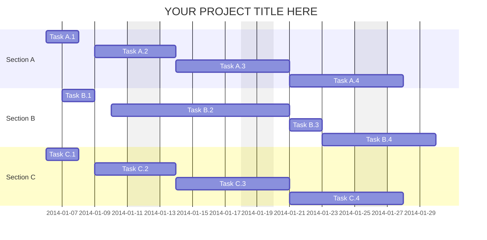
```mermaid 
gantt
    dateFormat  YYYY-MM-DD
    title       YOUR PROJECT TITLE HERE
    excludes    weekends
    %% (`excludes` accepts specific dates in YYYY-MM-DD format, days of the week ("sunday") or "weekends", but not the word "weekdays".)

    section Section A
    Task A.1            :         des1, 2014-01-06,2014-01-08
    Task A.2            :         des2, 2014-01-09, 3d
    Task A.3            :         des3, after des2, 5d
    Task A.4            :         des4, after des3, 5d

    section Section B
    Task B.1            :         des5, 2014-01-07,2014-01-09
    Task B.2            :         des6, 2014-01-10, 7d
    Task B.3            :         des7, after des3, 2d
    Task B.4            :         des8, after des7, 5d

    section Section C
    Task C.1            :         des9, 2014-01-06,2014-01-08
    Task C.2            :         des10, 2014-01-09, 3d
    Task C.3            :         des11, after des2, 5d
    Task C.4            :         des12, after des3, 5d

```

## 3. Feasibility Analysis

### 3.1 Technical Feasibility
Technically, this project is complex but doable. It's really just a standard Model-View-Controller app, with a UI that could be designed with a JavaScript framework like React or Vue, and then we would need a database with several tables and a server-side framework to communicate with it. While there would be some complex design issues in terms of getting the right data in the right place at the right time, these would be worked out in the design phase and at that point it's just coding it which shouldn't be that difficult, especially since we would have a full year to get it working. The main issue with the technical feasibility would be the security. Given that none of the project sponsors are cybersecurity experts, we would need to spend considerable resources looking into this, and since we would be dealing with information protected by FERPA and managed by an actual University, some of which is sensitive, this is not an area that we can afford to do poorly.

### 3.2 Organizational Feasibility
There is a couple of issues in terms of organizational feasibilites, however there are also some organizational feasibilities that are possible for us, so lets start with those. In terms of cost there is really no issue. The financial requirements of the whole system are extremely low. We would most likely need to buy nothing. We would however run into issues in terms of having a member of the current organization keep the system up to date semester over semester. Now onto the issues. The biggest issue is the security risk. Since there is a security risk that we face and we are not apart of the adminsitration there will be some difficulty to get access to information we would need. Also FERPA would make our project difficult since it protects students schedules which is something we would eventually need to deal with. Another problem is since our chosen organization has their own planning system and they don't want to have students getting mixed up with a variety of different planning softwares meaning it would be difficult to have an offical system that the university uses without replacing the current software. Another problem is that our organization is changing how registration works next year (the time we have to create our system) it creates extra difficulties to get the required items that we need from our orginization. Continuing on with the difficulties of obtaining our needed information we may run into some time constraints since we only have a year to get this project done we would need to request information from the registrar/IT early and even then we may not be able to start on certain parts of the project until we get that information meaning that we would have to wait to start certain parts of it.
## 4. Requirements Definition

### 4.1 Functional Requirements:

1. User Authentication
   - Secure login and registration for students, faculty, and staff.
   - Role-based access control to ensure appropriate access levels.

2. Course Planning

   - Intuitive interface for course search and planning.
   - Real-time course availability/offerings status displayed during selection.

3. Degree Progress Tracking

   - Integration with academic records to track degree requirements and progress.
   - Visual representation of completed and remaining courses.

4. Reporting and Analytics

   - Generate reports on course registration, student progress, and system usage.
   - Analytics dashboard for monitoring system performance and user engagement.

5. Course Search

   - Improved ability for course searching by name.

### 4.2 Nonfunctional Requirements:

1. **Operational**

2. **Performance**

3. **Security**

4. **Cultural and political**

## 5. Logical Design

> A set of use cases that illustrate the basic processes that the system needs to support.

### 5.1 Sequence Diagram

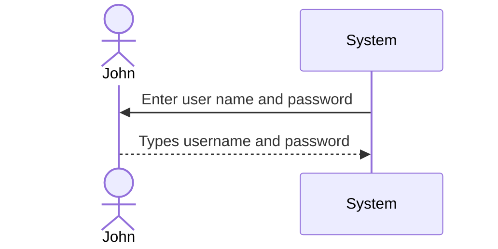
```mermaid
sequenceDiagram
   actor J as John
   participant S as System

   S->>J: Enter user name and password
   J-->>S: Types username and password

```

### 5.2 Use Cases
> *Reference Chapter 4*

#### Use Case Name:  Your use case name

> __ID__ :

> __Priority__ :

> __Actor__ :

> __Description__ :

> __Trigger__ :

> __Type__ :

> __Preconditions__ :
>   1. Condition 1
>   2. Condition 2
>   3. ......

| Normal Course:                            | Information for Steps       |
| ----------------------------------------- | --------------------------- |
| 1.0 Finalize Parts Request                |                             |
| 1. Parts room clerk opens the parts . . . | <--- Parts Request record   |
| 2. Parts room clerk verifies . . .        | <--- Shop Work Order Record |

> __Postconditions__ :
>   1. Condition 1
>   2. Condition 2
>   3. ......

| Summary Inputs           | Source           | Summary Outputs         | Destination               |
| ------------------------ | ---------------- | ----------------------- | ------------------------- |
| Final parts verification | Parts room clerk | Parts request record    | Parts room clerk          |
| Date/time completion     | Parts room clerk | Shop work order record  | Shop work order datastore |
|                          |                  | Work Order ready notice | Technician                |
 
### 5.3 Process Model (Data Flow Diagram)
Provided to the degree of depth necessary for building the system with good programming practices (generally 3-5 levels).

> Caleb - 1 and 8
> Matthew - 2 and 6
> Cheng Eu - 4 and 5
> Garret - 3 and 7

Level 1:
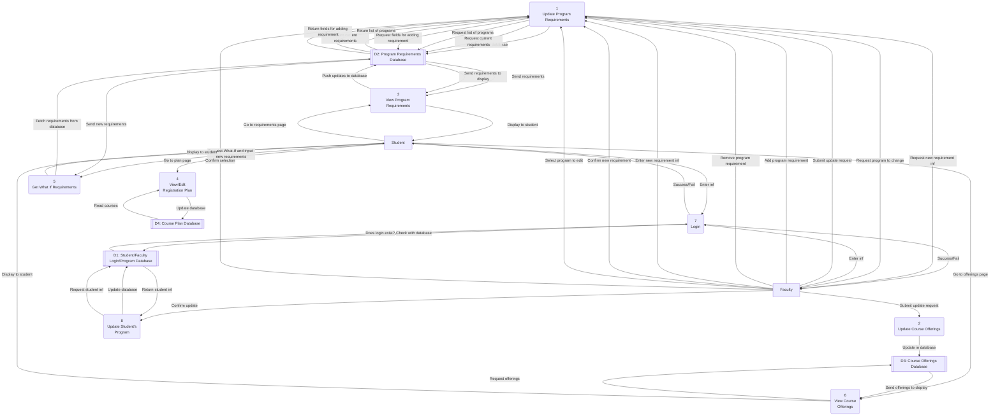
```mermaid
flowchart TD

d1[[D1: Student/Faculty Login/Program Database]]
d2[[D2: Program Requirements Database]]
d3[[D3: Course Offerings Database]]
d4[[D4: Course Plan Database]]
a1[Student]
a2[Faculty]
1(1\nUpdate Program Requirements)
2(2\nUpdate Course Offerings)
3(3\nView Program Requirements)
4(4\nView/Edit\nRegistration Plan)
5(5\nGet What If Requirements)
6(6\nView Course\nOfferings)
7(7\nLogin)
8(8\nUpdate Student's\nProgram)

a1 --Enter info--> 7 --Check with database--> d1 --Does login exist?--> 7
a2 --Enter info--> 7
7 --Success/Fail --> a1
7 --Success/Fail --> a2
a1 --Go to requirements page--> 3
d2 --Send requirements--> 3
a1 --Go to plan page--> 4 --Update database--> d4
d4 --Read courses-->4
3 --Push updates to database--> d2 --Send requirements to display--> 3 --Display to student--> a1
a1 --Go to offerings page--> 6 --Request offerings--> d3 --Send offerings to display--> 6 --Display to student--> a1
a2 --Submit update request--> 1 --Update in database-->d2
a2 --Submit update request--> 2 --Update in database-->d3
a2 --Confirm update-->8--Update database-->d1
a1--Request What-If and input new requirements-->5--Fetch requirements from database-->d2--Send new requirements-->5--Display to student-->a1
d2--Return current requirements-->1
1--Request current requirements-->d2
8--Request student info-->d1
d1--Return student info-->8
a2--Add program requirement-->1
a2--Remove program requirement-->1
1--Request new requirement info-->a2
a2--Enter new requirement info-->1
a2--Confirm new requirement-->1
1--Request program to change-->a2--Select program to edit-->1
1--Request list of programs-->d2--Return list of programs-->1
a2--Confirm selection--> 1
1--Request fields for adding requirement-->d2
d2--Return fields for adding requirement-->1
```

Level 2, Process 1:
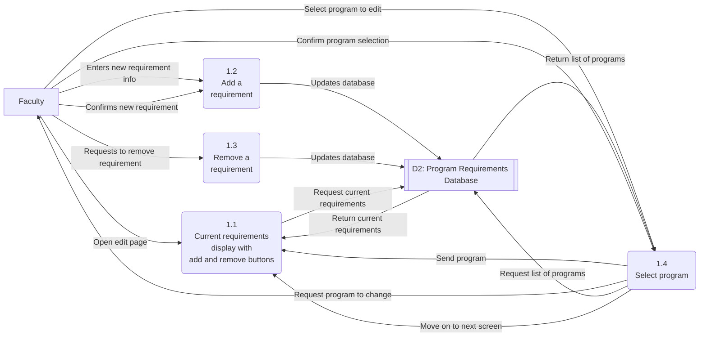
```mermaid
flowchart LR

f[Faculty]
d2[[D2: Program Requirements Database]]
1.1(1.1 \n Current requirements \n display with \n add and remove buttons)
1.2(1.2 \n Add a \n requirement)
1.3(1.3 \n Remove a \n requirement)
1.4(1.4 \n Select program)

1.4--Send program-->1.1
f --Open edit page--> 1.1
f --Enters new requirement info --> 1.2
f --Confirms new requirement--> 1.2
f --Requests to remove requirement--> 1.3
1.2 --Updates database-->d2
1.3 --Updates database-->d2
d2 --Return current requirements--> 1.1
1.1 --Request current requirements--> d2
1.4 --Request program to change--> f --Select program to edit--> 1.4
1.4 --Request list of programs--> d2 --Return list of programs --> 1.4
1.4 --Move on to next screen--> 1.1
f --Confirm program selection--> 1.4
```

Level 3, Process 1.1:
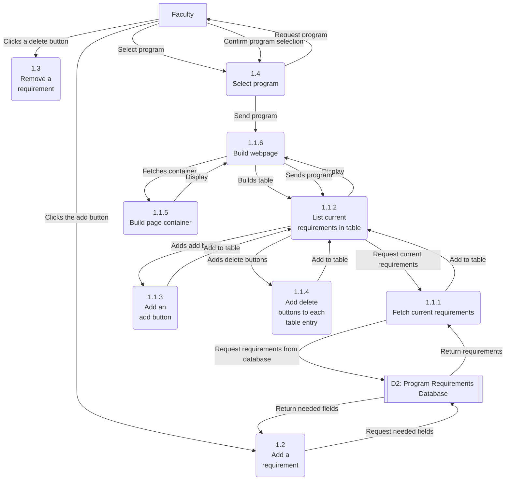
```mermaid
flowchart TD 

f[Faculty]
d2[[D2: Program Requirements Database]]
1.2(1.2 \n Add a \n requirement)
1.3(1.3 \n Remove a \n requirement)
1.1.1(1.1.1 \n Fetch current requirements)
1.1.2(1.1.2 \n List current \n requirements in table)
1.1.3(1.1.3 \n Add an \n add button)
1.1.4(1.1.4 \n Add delete \n buttons to each \n table entry)
1.1.5(1.1.5 \n Build page container)
1.1.6(1.1.6 \n Build webpage)
1.4(1.4 \n Select program)

1.4 --Request program--> f
f --Select program--> 1.4
f --Confirm program selection--> 1.4
1.4 --Send program-->1.1.6
1.1.6 --Fetches container--> 1.1.5 --Display --> 1.1.6
1.1.6 --Builds table--> 1.1.2 --Display--> 1.1.6
1.1.2 --Adds add button--> 1.1.3 --Add to table--> 1.1.2
1.1.2 --Adds delete buttons--> 1.1.4 --Add to table--> 1.1.2
1.1.2 --Request current requirements--> 1.1.1 --Add to table--> 1.1.2
1.1.1 --Request requirements from database--> d2 --Return requirements--> 1.1.1
f --Clicks the add button--> 1.2
f --Clicks a delete button--> 1.3
1.1.6 --Sends program--> 1.1.2
1.2 --Request needed fields--> d2
d2 --Return needed fields--> 1.2
```

Level 4, Process 1.1.1
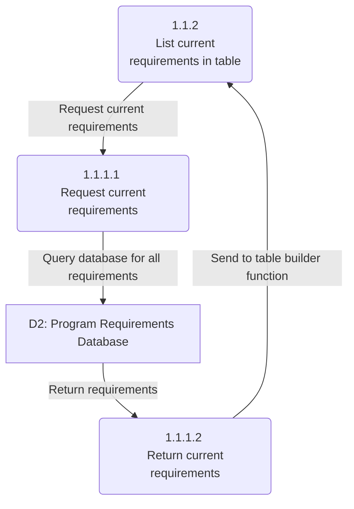
```mermaid
flowchart TD

1.1.2(1.1.2 \n List current \n requirements in table)
d2[D2: Program Requirements Database]
1.1.1.1(1.1.1.1 \n Request current requirements)
1.1.1.2(1.1.1.2 \n Return current requirements)

1.1.2 --Request current requirements--> 1.1.1.1
1.1.1.1 --Query database for all requirements--> d2
d2 --Return requirements --> 1.1.1.2
1.1.1.2 --Send to table builder function--> 1.1.2
```

Level 4, Process 1.1.2
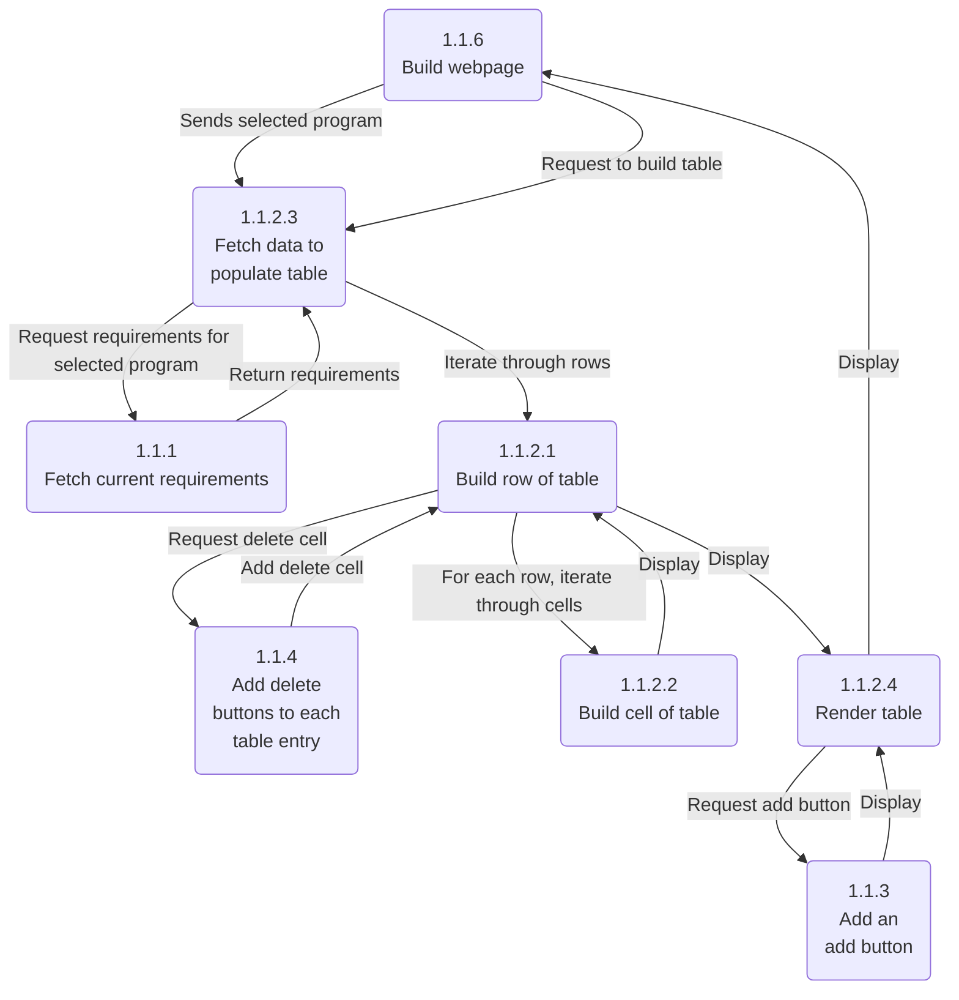
```mermaid
flowchart TD

1.1.6(1.1.6 \n Build webpage)
1.1.4(1.1.4 \n Add delete \n buttons to each \n table entry)
1.1.3(1.1.3 \n Add an \n add button)
1.1.1(1.1.1 \n Fetch current requirements)
1.1.2.1(1.1.2.1 \n Build row of table)
1.1.2.2(1.1.2.2 \n Build cell of table)
1.1.2.3(1.1.2.3 \n Fetch data to \n populate table)
1.1.2.4(1.1.2.4 \n Render table)

1.1.6 --Sends selected program--> 1.1.2.3
1.1.6 --Request to build table--> 1.1.2.3
1.1.2.3 --Request requirements for selected program--> 1.1.1
1.1.2.3 --Iterate through rows--> 1.1.2.1
1.1.2.1 --For each row, iterate through cells--> 1.1.2.2
1.1.2.2 --Display--> 1.1.2.1
1.1.2.1 --Request delete cell--> 1.1.4
1.1.4 --Add delete cell--> 1.1.2.1
1.1.2.1 --Display--> 1.1.2.4
1.1.2.4 --Request add button --> 1.1.3
1.1.3 --Display--> 1.1.2.4
1.1.2.4 --Display--> 1.1.6
1.1.1 --Return requirements--> 1.1.2.3
```

Level 5, Process 1.1.2.1
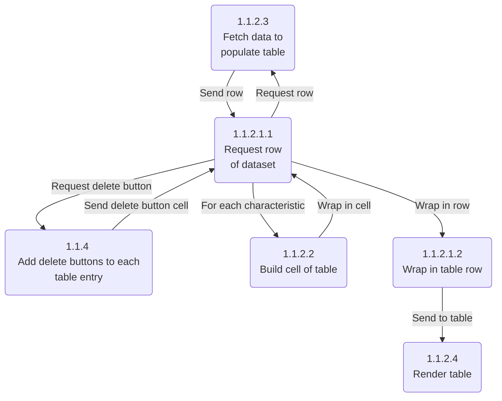
```mermaid
flowchart TD

1.1.2.3(1.1.2.3 \n Fetch data to \n populate table)
1.1.4(1.1.4 \n Add delete buttons to each table entry)
1.1.2.2(1.1.2.2 \n Build cell of table)
1.1.2.4(1.1.2.4 \n Render table)
1.1.2.1.1(1.1.2.1.1 \n Request row \n of dataset)
1.1.2.1.2(1.1.2.1.2 \n Wrap in table row)

1.1.2.1.1 --For each characteristic--> 1.1.2.2
1.1.2.2 --Wrap in cell--> 1.1.2.1.1
1.1.2.1.1 --Request delete button--> 1.1.4
1.1.4 --Send delete button cell--> 1.1.2.1.1
1.1.2.1.1 --Wrap in row--> 1.1.2.1.2
1.1.2.3 --Send row--> 1.1.2.1.1
1.1.2.1.1 --Request row--> 1.1.2.3
1.1.2.1.2 --Send to table--> 1.1.2.4
```

Level 5, Process 1.1.2.2
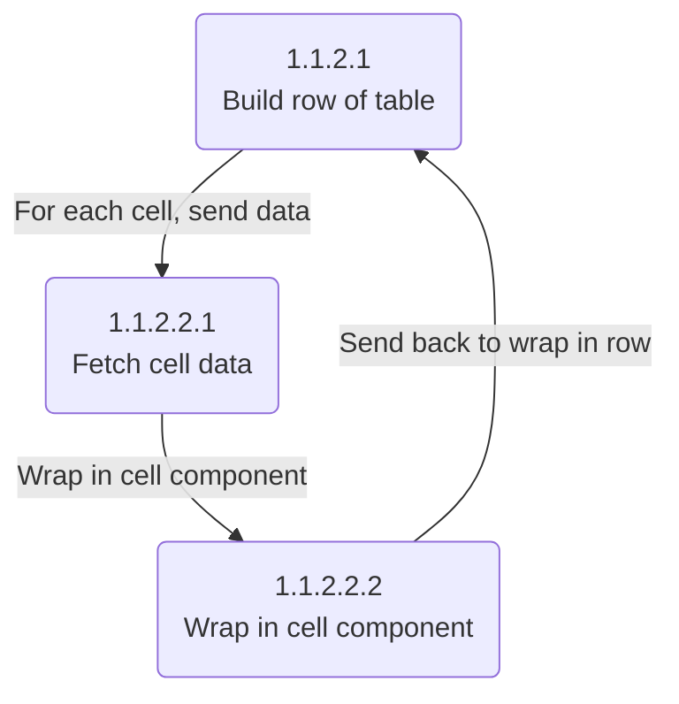
```mermaid
flowchart TD

1.1.2.1(1.1.2.1 \n Build row of table)
1.1.2.2.1(1.1.2.2.1 \n Fetch cell data)
1.1.2.2.2(1.1.2.2.2 \n Wrap in cell component)

1.1.2.1 --For each cell, send data--> 1.1.2.2.1
1.1.2.2.1 --Wrap in cell component--> 1.1.2.2.2
1.1.2.2.2 --Send back to wrap in row--> 1.1.2.1
```

Level 5, Process 1.1.2.3
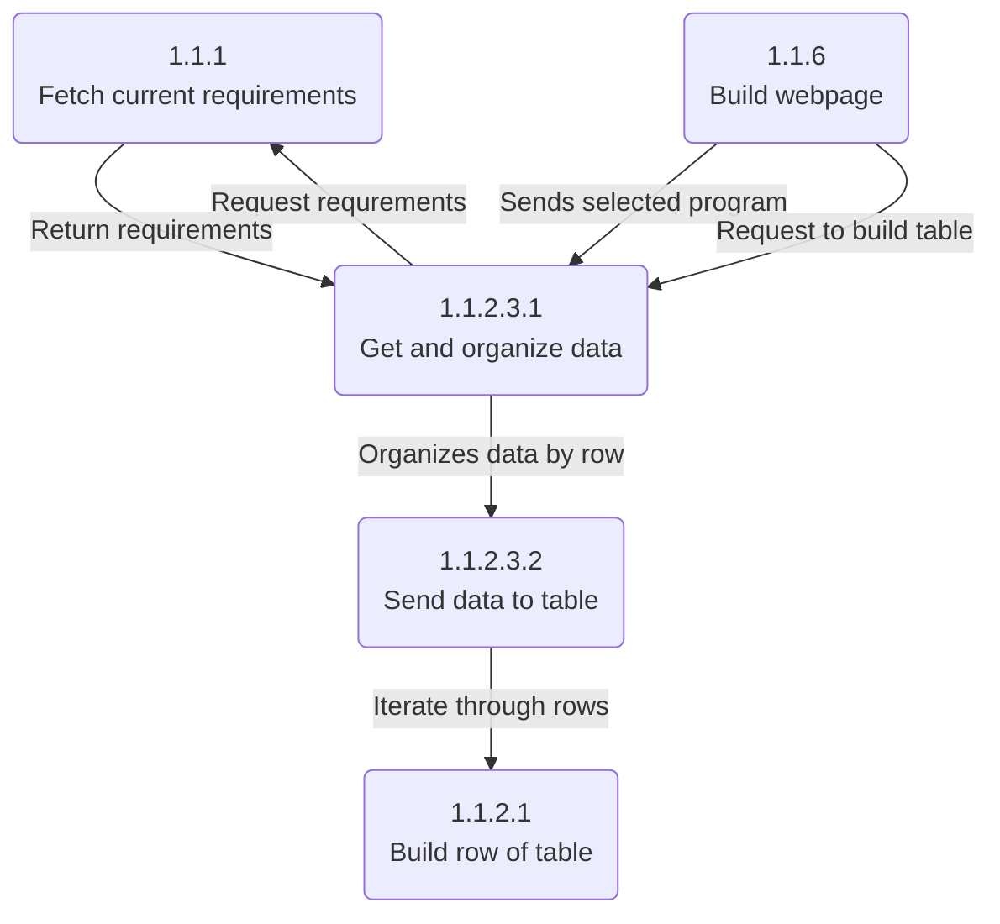
```mermaid
flowchart TD

1.1.1(1.1.1 \n Fetch current requirements)
1.1.6(1.1.6 \n Build webpage)
1.1.2.1(1.1.2.1 \n Build row of table)
1.1.2.3.1(1.1.2.3.1 \n Get and organize data)
1.1.2.3.2(1.1.2.3.2 \n Send data to table)

1.1.2.3.1 --Request requrements--> 1.1.1
1.1.1 --Return requirements--> 1.1.2.3.1
1.1.6 --Sends selected program--> 1.1.2.3.1
1.1.6 --Request to build table--> 1.1.2.3.1
1.1.2.3.1 --Organizes data by row--> 1.1.2.3.2
1.1.2.3.2 --Iterate through rows--> 1.1.2.1
```

Level 5, Process 1.1.2.4
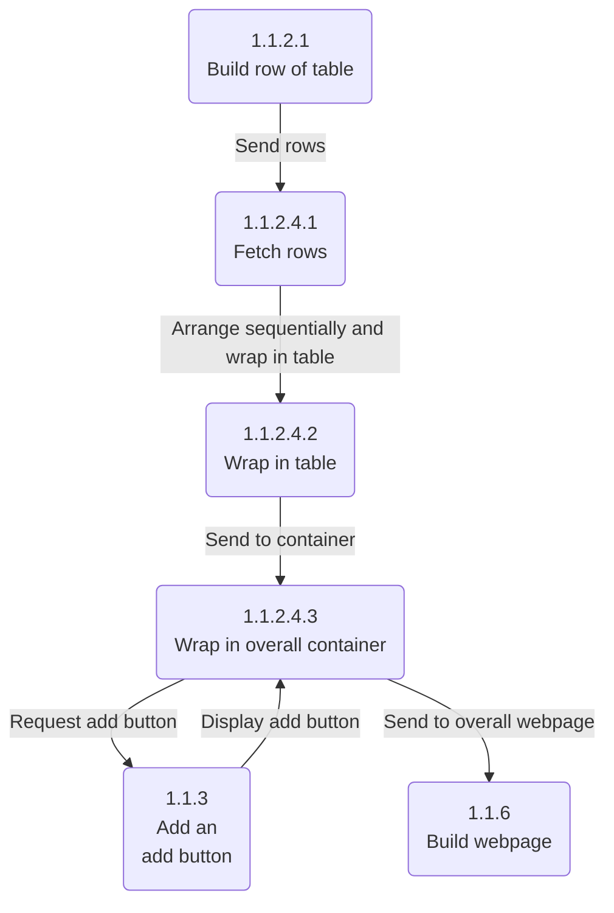
```mermaid
flowchart TD

1.1.2.1(1.1.2.1 \n Build row of table)
1.1.3(1.1.3 \n Add an \n add button)
1.1.6(1.1.6 \n Build webpage)
1.1.2.4.1(1.1.2.4.1 \n Fetch rows)
1.1.2.4.2(1.1.2.4.2 \n Wrap in table)
1.1.2.4.3(1.1.2.4.3 \n Wrap in overall container)

1.1.2.1 --Send rows--> 1.1.2.4.1
1.1.2.4.1 --Arrange sequentially and wrap in table--> 1.1.2.4.2
1.1.2.4.2 --Send to container--> 1.1.2.4.3
1.1.2.4.3 --Request add button--> 1.1.3
1.1.3 --Display add button--> 1.1.2.4.3
1.1.2.4.3 --Send to overall webpage --> 1.1.6
```

Level 4, Process 1.1.6:
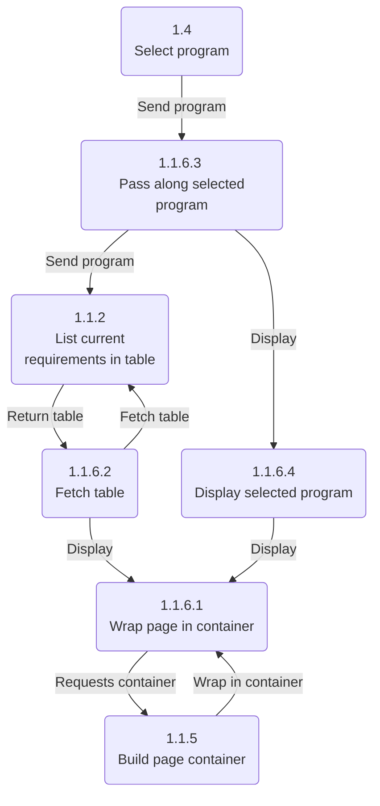
```mermaid
flowchart TD

1.4(1.4 \n Select program)
1.1.5(1.1.5 \n Build page container)
1.1.2(1.1.2 \n List current \n requirements in table)
1.1.6.1(1.1.6.1 \n Wrap page in container)
1.1.6.2(1.1.6.2 \n Fetch table)
1.1.6.3(1.1.6.3 \n Pass along selected program)
1.1.6.4(1.1.6.4 \n Display selected program)

1.4 --Send program--> 1.1.6.3 --Send program--> 1.1.2
1.1.6.3 --Display--> 1.1.6.4
1.1.6.2 --Fetch table--> 1.1.2 --Return table--> 1.1.6.2
1.1.6.2 --Display--> 1.1.6.1
1.1.6.4 --Display--> 1.1.6.1
1.1.5 --Wrap in container--> 1.1.6.1
1.1.6.1 --Requests container--> 1.1.5

```

Level 3, Process 1.2:
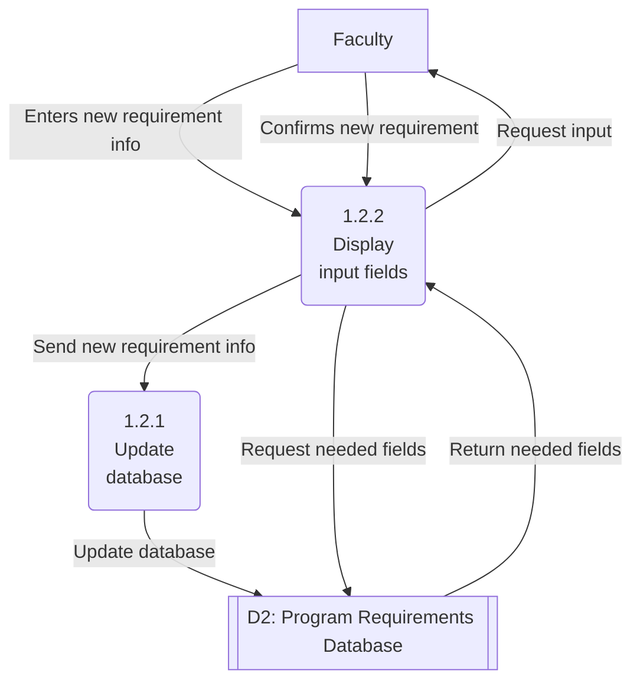
```mermaid
flowchart TD

f[Faculty]
d2[[D2: Program Requirements Database]]
1.2.1(1.2.1 \n Update \n database)
1.2.2(1.2.2 \n Display \n input fields)

f --Enters new requirement info --> 1.2.2
f --Confirms new requirement--> 1.2.2
1.2.2 --Request input--> f
1.2.2 --Send new requirement info --> 1.2.1
1.2.1 --Update database --> d2
1.2.2 --Request needed fields--> d2
d2 --Return needed fields --> 1.2.2
```

Level 4, Process 1.2.2:
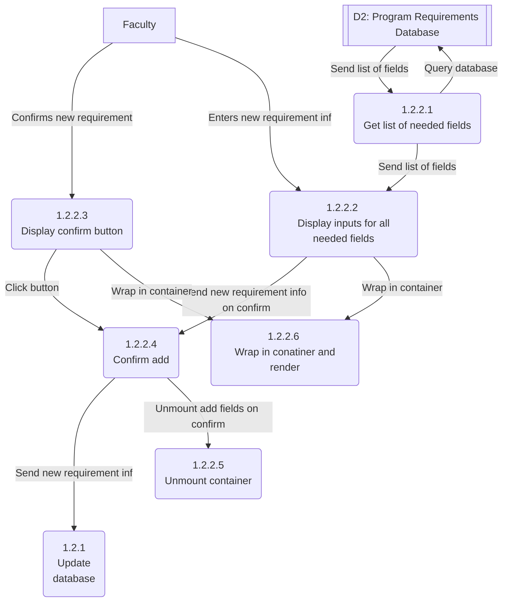
```mermaid
flowchart TD

f[Faculty]
d2[[D2: Program Requirements Database]]
1.2.2.1(1.2.2.1 \n Get list of needed fields)
1.2.2.2(1.2.2.2 \n Display inputs for all needed fields)
1.2.2.3(1.2.2.3 \n Display confirm button)
1.2.2.4(1.2.2.4 \n Confirm add)
1.2.2.5(1.2.2.5 \n Unmount container)
1.2.2.6(1.2.2.6 \n Wrap in conatiner and render)
1.2.1(1.2.1 \n Update \n database)

f --Confirms new requirement--> 1.2.2.3
f --Enters new requirement info--> 1.2.2.2
1.2.2.1 --Send list of fields--> 1.2.2.2
1.2.2.2 --Send new requirement info on confirm--> 1.2.2.4
1.2.2.3 --Click button--> 1.2.2.4
1.2.2.4 --Send new requirement info--> 1.2.1
1.2.2.2 --Wrap in container--> 1.2.2.6
1.2.2.3 --Wrap in container--> 1.2.2.6
1.2.2.4 --Unmount add fields on confirm--> 1.2.2.5
1.2.2.1 --Query database--> d2
d2 --Send list of fields--> 1.2.2.1
```

Level 3, Process 1.3:
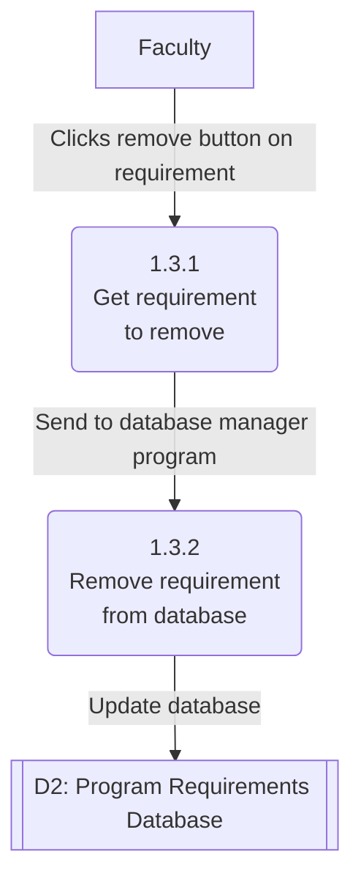
```mermaid
flowchart TD

f[Faculty]
d2[[D2: Program Requirements Database]]
1.3.1(1.3.1 \n Get requirement \n to remove)
1.3.2(1.3.2 \n Remove requirement \n from database)

f --Clicks remove button on requirement--> 1.3.1
1.3.1 --Send to database manager program--> 1.3.2
1.3.2 --Update database--> d2
```

Level 3, Process 1.4:
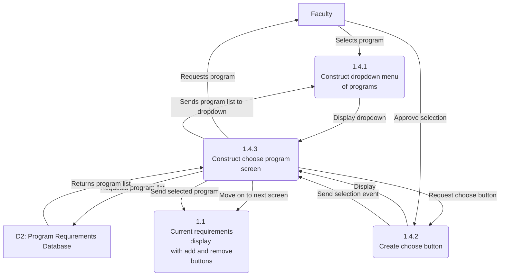
```mermaid
flowchart TD

f[Faculty]
1.1(1.1 \n Current requirements display \n with add and remove buttons)
1.4.1(1.4.1 \n Construct dropdown menu \n of programs)
1.4.2(1.4.2 \n Create choose button)
1.4.3(1.4.3 \n Construct choose program screen)
d2[D2: Program Requirements Database]

1.4.3 --Requests program--> f
f --Selects program--> 1.4.1
1.4.3 --Requests program list--> d2
d2 --Returns program list--> 1.4.3
1.4.3 --Sends program list to dropdown--> 1.4.1
1.4.1 --Display dropdown--> 1.4.3
1.4.3 --Request choose button--> 1.4.2
1.4.2 --Display--> 1.4.3
1.4.3 --Move on to next screen--> 1.1
1.4.3 --Send selected program--> 1.1
f --Approve selection--> 1.4.2
1.4.2 --Send selection event--> 1.4.3
```

Level 4, Process 1.4.3:
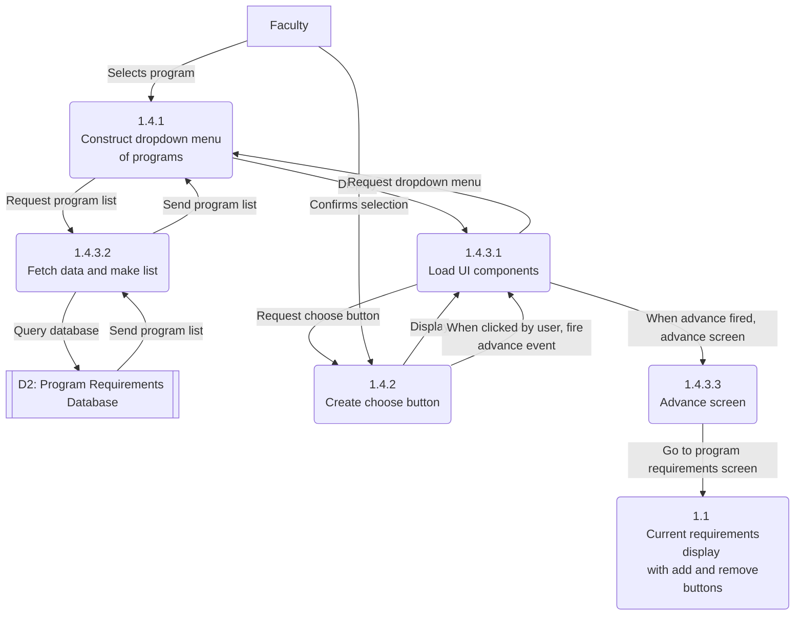
```mermaid
flowchart TD

f[Faculty]
d2[[D2: Program Requirements Database]]
1.4.1(1.4.1 \n Construct dropdown menu \n of programs)
1.4.2(1.4.2 \n Create choose button)
1.1(1.1 \n Current requirements display \n with add and remove buttons)
1.4.3.1(1.4.3.1 \n Load UI components)
1.4.3.2(1.4.3.2 \n Fetch data and make list)
1.4.3.3(1.4.3.3 \n Advance screen)

1.4.1 --Display--> 1.4.3.1
1.4.2 --Display--> 1.4.3.1
1.4.3.2 --Query database--> d2
d2 --Send program list--> 1.4.3.2
1.4.3.2 --Send program list--> 1.4.1
1.4.1 --Request program list--> 1.4.3.2
1.4.3.3 --Go to program requirements screen--> 1.1
1.4.2 --When clicked by user, fire advance event--> 1.4.3.1
1.4.3.1 --When advance fired, advance screen--> 1.4.3.3
1.4.3.1 --Request choose button--> 1.4.2
1.4.3.1 --Request dropdown menu--> 1.4.1
f --Selects program--> 1.4.1
f --Confirms selection--> 1.4.2
```

Level 5, Process 1.4.3.1
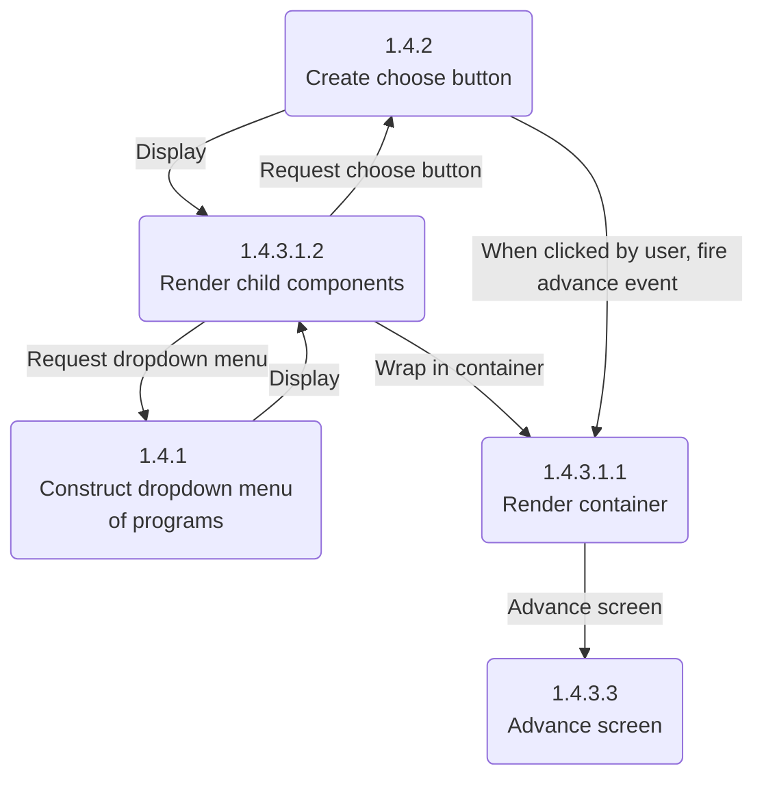
```mermaid
flowchart TD

1.4.2(1.4.2 \n Create choose button)
1.4.1(1.4.1 \n Construct dropdown menu of programs)
1.4.3.1.1(1.4.3.1.1 \n Render container)
1.4.3.1.2(1.4.3.1.2 \n Render child components)
1.4.3.3(1.4.3.3 \n Advance screen)

1.4.3.1.2 --Request dropdown menu--> 1.4.1
1.4.1 --Display--> 1.4.3.1.2
1.4.3.1.2 --Request choose button--> 1.4.2
1.4.2 --Display--> 1.4.3.1.2
1.4.3.1.2 --Wrap in container--> 1.4.3.1.1
1.4.2 --When clicked by user, fire advance event--> 1.4.3.1.1
1.4.3.1.1 --Advance screen--> 1.4.3.3
```

Level 5, Process 1.4.3.2
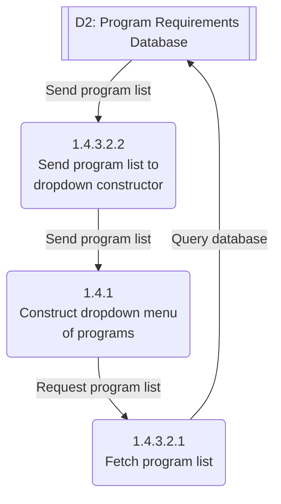
```mermaid
flowchart TD

d2[[D2: Program Requirements Database]]
1.4.1(1.4.1 \n Construct dropdown menu \n of programs)
1.4.3.2.1(1.4.3.2.1 \n Fetch program list)
1.4.3.2.2(1.4.3.2.2 \n Send program list to \n dropdown constructor)

1.4.1 --Request program list--> 1.4.3.2.1
1.4.3.2.1 --Query database --> d2
d2 --Send program list--> 1.4.3.2.2
1.4.3.2.2 --Send program list--> 1.4.1
```

Level 5, Process 1.4.3.3
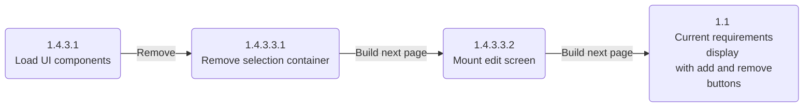
```mermaid
flowchart LR

1.4.3.1(1.4.3.1 \n Load UI components)
1.1(1.1 \n Current requirements display \n with add and remove buttons)
1.4.3.3.1(1.4.3.3.1 \n Remove selection container)
1.4.3.3.2(1.4.3.3.2 \n Mount edit screen)

1.4.3.1 --Remove--> 1.4.3.3.1
1.4.3.3.1 --Build next page--> 1.4.3.3.2
1.4.3.3.2 --Build next page--> 1.1
```

Level 2, Process 8:
```mermaid
flowchart TD

f[Faculty]
d1[[D1: Student/Faculty Login/Program Database]]
8.1(8.1 \n Select student)
8.2(8.2 \n Choose Update \n Program Option)
8.3(8.3 \n Select Program)
8.4(8.4 \n Send New Program to Database)

f --Get to main screen select student--> 8.1
8.1 --Request student info--> d1
d1 --Display student info and options--> 8.2
8.2 --Selects a new program--> 8.3
8.3 --Confirm request--> 8.4
8.4 --Update database--> d1

```

### 5.4 Data Model (Entity Relationship Diagram)
> *Reference Chapter 5*

> A set of data models and descriptions for the to‐be system. This may include data models of the as‐is system that will be replaced.

### 5.4 Structure Chart Diagram
> *Reference Chapter 9*

## 6. Appendices
> These contain additional material relevant to the proposal, often used to support the recommended system. This might include results of a questionnaire survey or interviews, industry reports and statistics, etc.
